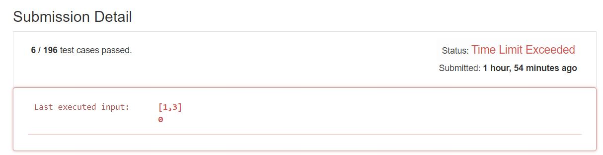
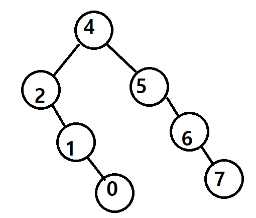

# 33. Search in Rotated Sorted Array
Suppose an array sorted in ascending order is rotated at some pivot unknown to you beforehand.  

(i.e., [0,1,2,4,5,6,7] might become [4,5,6,7,0,1,2]).  

You are given a target value to search. If found in the array return its index, otherwise return -1.  

You may assume no duplicate exists in the array.  

Your algorithm's runtime complexity must be in the order of O(log n).     

pivot을 모르는 상황에서 주어진 acsending order의 vector에서 O(logN)시간안에 target 변수와 같은 수를 찾는 방법     

**Example1:**   
```
Input: nums = [4,5,6,7,0,1,2], target = 0
Output: 4  
```

**Example2:**   
```
Input: nums = [4,5,6,7,0,1,2], target = 3
Output: -1
```

## trial1
### Intuition
```
1. binary search tree의 방법으로 구현한다.   
(Use Binary search tree algorithm.)  
2. des라는 변수를 만들어서 이전에 실행하던것의 반대로 진행하게 되는 경우 내가 찾던 target이 arr에 없는것으로 간주한다.  
(I used variable "des" which figures out what previous status(reduce or increment from pivot) is to find out that there is no target number in the array.)  
3. 1씩 인덱스를 증감하며 찾아준다.  
(Search target number by increasing or decreasing 1.)  

```
### Codes  
```cpp
class Solution {
public:
	int search(vector<int>& nums, int target) {
		if (nums.size() > 0) {
			int i = 0;
			if (nums.size() == 1) { if (nums[i] != target) return -1; }
			int des = 2;
			while (nums[i] != target) {
				if (nums[i] > target) {//현재 위치가 target보다 큰경우 des=1
					if (des == 0) { return -1; }//이경우에는 없는것으로 간주
					des = 1;
					i -= 1;
					if (i < 0) {
						i = nums.size() - 1;
					}
				}
				else {//des==0
					if (des == 1) { return -1; }//없는것으로 간주
					des = 0;
					i += 1;
					if (i > nums.size()) {
						i = 0;
					}
				}
			}
			return i;
		}
		return -1;
	}
};
```

### Results (Performance)  
**Time Limit Exceeded**

<p align="center"> 

</p>

## trial2
### Intuition
```   
1. des 대신 p(prev)라는 변수로 이전 index의 값과 비교하여 tree로 따지면 pivot의 오른쪽을 탐색하던 도중에 pivot의 왼쪽값이 나온경우를 판단해준다.  
(Instead of using "des", I used "p" variable to compare future index value with previous index value. This step is to find the case that while searching right side of pivot in binary tree, suddenly left side number of pivot appears. )   
2. 1씩 인덱스를 증감하며 찾아준다.    
(Search target number by increasing or decreasing 1.)   
3. 다음 index의 값과 현재 index의 값 사이에 target이 존재한다면 array에 target number가 존재하지 않는것을 간주한다.  
(if there is target number between number of next index and current index, there is no target number in the array. )   
```
### Codes  
```cpp
class Solution {
public:
	int search(vector<int>& nums, int target) {
		if (nums.size() > 0) {
			int i = 0;
			if (nums.size() == 1) { if (nums[i] != target) return -1; }
			while (nums[i] != target) {
				if (nums[i] > target) {//현재가 클때 왼쪽 이동
					int p = i;
					if (i - 1 <0) { i = nums.size() - 1; }
					else { i--; }
					if (nums[i] < target) return -1;//사이에 값이 없는경우 target은 없는것으로 간주
					if (nums[i] > nums[p]) return -1;//이미 주어진 array의 한바퀴를 다 돌은 상태인경우
				}
				else {//현재보다 작을때 오른쪽 이동
					int p = i;
					if (i + 1 >= nums.size()) { return -1; }//이미 값이 없는것
					else { i++; }
					if (nums[i] > target) return -1;//사이에 값이 없는경우 target은 없는것으로 간주
					if (nums[i] < nums[p]) return -1;//이미 주어진 array의 한바퀴를 다 돌은 상태인경우
				}
			}
			return i;
		}
		return -1;
	}
};
```

### Results (Performance)  
**Runtime:** 4 ms  
**Memory Usage:** 8.2 MB 

### Discussion
내가 푼 방법에서는 binary search tree가 가장 worst case로 만들어진 경우 search를 하여 target을 찾는 방법으로 구현된 것이다. 밑의 사진과 같이 BST가 만들어져 있다.   
In my solution, it searches for the target with BST made as the worst case. BST is made as shown in the picture below.  

<p align="center"> 

</p>

더 나은 방법을 찾기 위해서는 pivot을 찾아서 binary search를 하는 것이다.  
To find a better way, find a pivot and do a binary search.  

### 문제 URL (LeetCode)  
https://leetcode.com/problems/search-in-rotated-sorted-array/
