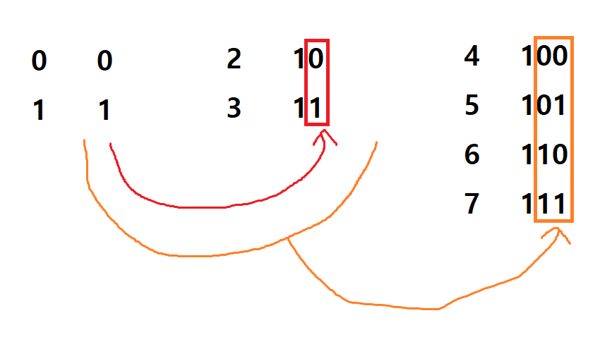

# 338. Counting Bits
Given a non negative integer number num.   
For every numbers i in the range 0 ≤ i ≤ num calculate the number of 1's in their binary representation and return them as an array.  

**Example1:**   
```
Input: 2
Output: [0,1,1] 
```

**Example2:**   
```
Input: 5
Output: [0,1,1,2,1,2]
```

## trial1
### Intuition
```
1. non-negative integer를 bit로 표현 했을때 1의 개수에 대한 규칙을 찾아서 문제를 해결하였다.
2. bit의 앞자리에 1씩 추가될 때마다 이전까지 계산했던 모든 bit의 1의 개수에 1을 더한다.
3. 위의 알고리즘을 수행하기 위해서는 memoization을 이용하여야 한다.

1. I solved the problem by finding a rule for counting 1 from non-negative integer expressed as a bit.
2. Whenever 1 is added to the beginning of a bit, 1 is added to the number of 1s of all the bits previously calculated.  
3. Using memoization technique to implement algorithm above.
```
<p align="center"> 

</p>

### Codes  
```cpp
class Solution {
public:
	vector<int> countBits(int num) {
		vector<int> arr;
		arr.push_back(0);
		if (num == 0) return arr;
		arr.push_back(1);
		if (num == 1) return arr;
		int cursize = arr.size();
		while(arr.size()!=num+1){
			for (int i = 0; i < cursize; i++) {
				arr.push_back(arr[i] + 1);
				if (arr.size() == num + 1) return arr;
			}
			cursize = arr.size();
		}
		return arr;
	}
};
```

### Results (Performance)  
**Runtime:** Runtime: 52 ms num.size+1 만큼의 계산량이므로 (O(n))  
**Memory Usage:** 9.4 MB n사이즈의 vector 하나만 추가하였으므로 (O(n))  


<p align="center"> 

</p>

### Discussion
다른 사람의 코드를 확인해 보니 더 좋은 방법이 있어서 메모를 해놓았다.  
```
class Solution {
public:
    vector<int> countBits(int num) {
        vector<int> res(num+1,0);
        for (int i = 1; i <= num; i++) {
            // 位操作
            res[i] = res[i & (i-1)] + 1;
        }
        
        return res;
    }
};
```
**Runtime:** Runtime: 44 ms   
**Memory Usage:** 9.4 MB   

위의 방법 또한 memoization을 사용하였고 bit의 & 연산법을 이용하여 얻은 index에 대한 결과에 1을 더해주는 방법이다.  
아이디어는 위에서 구현한 방법과 비슷하지만 인덱스를 좀더 효율적으로 가져오는 방법을 이용하여 runtime을 더 줄였다.  

I checked other person's code which was more efficient, so I memoed here.
Above process also used memoization, and utilized & calculation to get index and plus 1 to the value of each index.
This idea is similar to my algorithm but getting indexes more efficiently to get better runtime speed.

### 문제 URL (LeetCode)  
https://leetcode.com/problems/counting-bits/
