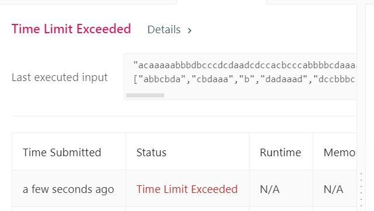

# 160. Intersection of Two Linked Lists
Write a program to find the node at which the intersection of two singly linked lists begins.  

**Notes:**  
If the two linked lists have no intersection at all, return null.  
The linked lists must retain their original structure after the function returns.  
You may assume there are no cycles anywhere in the entire linked structure.  
Your code should preferably run in O(n) time and use only O(1) memory.  

For example, the following two linked lists:  

<p align="center"> 

</p>
begin to intersect at node c1.   


**Example1:**   
<p align="center"> 

</p>  

```
Input: intersectVal = 8, listA = [4,1,8,4,5], listB = [5,0,1,8,4,5], skipA = 2, skipB = 3
Output: Reference of the node with value = 8
Input Explanation: The intersected node's value is 8 (note that this must not be 0 if the two lists intersect). From the head of A, it reads as [4,1,8,4,5]. From the head of B, it reads as [5,0,1,8,4,5]. There are 2 nodes before the intersected node in A; There are 3 nodes before the intersected node in B.
```

**Example2:**   
<p align="center"> 

</p>  

```
Input: intersectVal = 2, listA = [0,9,1,2,4], listB = [3,2,4], skipA = 3, skipB = 1
Output: Reference of the node with value = 2
Input Explanation: The intersected node's value is 2 (note that this must not be 0 if the two lists intersect). From the head of A, it reads as [0,9,1,2,4]. From the head of B, it reads as [3,2,4]. There are 3 nodes before the intersected node in A; There are 1 node before the intersected node in B.
```

**Example3:**   
<p align="center"> 

</p>  

```
Input: intersectVal = 0, listA = [2,6,4], listB = [1,5], skipA = 3, skipB = 2
Output: null
Input Explanation: From the head of A, it reads as [2,6,4]. From the head of B, it reads as [1,5]. Since the two lists do not intersect, intersectVal must be 0, while skipA and skipB can be arbitrary values.
Explanation: The two lists do not intersect, so return null.
```

## trial1
### Intuition
```
1.  headA에 대한 linked list를 unorded map에 삽입하여 다른 headB에 대한 linked list의 주소가 map에 존재하는지 확인하는 방식을 사용하였다.

1. By inserting the linked list for headA into the unorded map, a method was used to check if the address of the linked list for other headB exists in the map.  
```
### Codes  
```cpp
class Solution {
public:
	ListNode *getIntersectionNode(ListNode *headA, ListNode *headB) {
		unordered_map<ListNode *, int> m;
		ListNode * cur = headA;
		while (cur != NULL) {
			m.insert(make_pair(cur, 1));
			cur = cur->next;
		}
		cur = headB;
		while (cur != NULL) {
			if (m.find(cur) != m.end()) {
				return cur;
			}
			cur = cur->next;
		}
		return NULL;
	}
};
```

### Results (Performance)  
**Runtime:**  64 ms         
**Memory Usage:** 18.2 MB

<p align="center"> 

</p>


### 문제 URL (LeetCode)  
https://leetcode.com/problems/intersection-of-two-linked-lists/