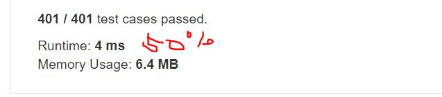

# 202. Happy Number
Write an algorithm to determine if a number is "happy".

A happy number is a number defined by the following process: Starting with any positive integer, replace the number by the sum of the squares of its digits, and repeat the process until the number equals 1 (where it will stay), or it loops endlessly in a cycle which does not include 1. Those numbers for which this process ends in 1 are happy numbers.

**Example1:**   
```
Input: 19
Output: true
Explanation: 
12 + 92 = 82
82 + 22 = 68
62 + 82 = 100
12 + 02 + 02 = 1
```

## trial1
### Intuition
```
unordered_map을 이용해서 각 자리수를 더해서 나온 sum 값을 저장하여 진행한다.
각 자리수를 더한 sum값이 다시 나왔다면 cycle이 존재하는 것을 간주하고 false를 반환한다.
만약에 sum값이 1이라면 그 숫자는 happy number을 만족한다.

Proceed by storing the sum value obtained by adding each digit using unordered_map.
If the sum value after adding each digit comes out again, it is assumed that the cycle exists and returns false.
If the sum value is 1, the number satisfies the happy number.
```
### Codes  
```cpp
class Solution {
public:
	bool isHappy(int n) {
		int sum = n;
		int nom, rem = 0;
		unordered_map<int, bool> m;
		while (sum!=1) {//sum이 1이면 
			nom = sum;
			sum = 0;
			while (nom > 0) {//nominator이 0이상일때 각자리수의 power을 진행
				rem = nom % 10;
				sum += pow(rem, 2);
				nom /=10;
			}
			if (m.find(sum) != m.end()) {//map에 더한값이 이미 존재하면 cycle
				return false;
			}
			m[sum] = true;
		}
		return true;
	}
};
```

### Results (Performance)  
**Runtime:**  4 ms
**Memory Usage:** 	6.4 MB

<p align="center"> 

</p>


### 문제 URL (LeetCode)  
https://leetcode.com/problems/happy-number/