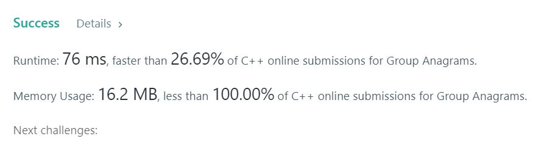

# 49. Group Anagrams
Given an array of strings, group anagrams together.  

**Note**
You may not engage in multiple transactions at the same time (i.e., you must sell the stock before you buy again).  

**Example1:**   
```
Input: ["eat", "tea", "tan", "ate", "nat", "bat"],
Output:
[
  ["ate","eat","tea"],
  ["nat","tan"],
  ["bat"]
]
```

## trial1
### Intuition
```
string을 sort하고 같은 string의 존재 여부를 조사하기 위해 unordered_map을 사용하였다.
tmp는 string들의 순서를 알파벳 순으로 되어있는 정렬해 놓은 vector이다.
m에서 단어에 대해서 조사해서 존재하지 않는 경우에는 map에 넣고 동시에 res 2차원 벡터의 새로운 행으로 추가를 한다. 그리고 행의 인덱스를 map의 두번째 요소로 넣어준다.
이미 단어가 존재한다면 map에서 저장된 행 인덱스를 이용하여 해당 행의 열로 추가한다.

Unordered_map was used to check whether the same string exists and sort algorithm was utilized to find the anagram easily.
"tmp" is an ordered vector of strings in alphabetical order.
Search for the word in "m", if it doesn't exist, add it to the map and add it as a new row of "res" 2D vectors. Then, insert the index of the row as the second element of the map.
If a word already exists, it is added as a column of the corresponding row using the row index stored in the map.
```
### Codes  
```cpp
class Solution {
public:
	vector<vector<string>> groupAnagrams(vector<string>& strs) {
		vector<string> tmp = strs;
		vector<vector<string>> res;
		unordered_map<string, int> m;
		int j = -1;
		for (int i = 0; i < strs.size(); i++) {
			sort(tmp[i].begin(), tmp[i].end());//단어에 대한 반복문 돌리기
			auto it = m.find(tmp[i]);
			if (it == m.end()) {//새로운 단어일때
				j++;
				m[tmp[i]] = j;
				res.push_back({ strs[i] });//세트를 res에 넣기
			}
			else {//단어가 이미 존재할때
				res[it->second].push_back(strs[i]);
			}
		}
		return res;
	}
};
```

### Results (Performance)  
**Runtime:**  76 ms  map에서 find할때 최대 O(n)만큼 걸리므로 O(n^2)만큼의 시간이 걸린다.  
**Memory Usage:** 	16.2 MB

<p align="center"> 

</p>

### Discussion
다른사람의 코드를 살펴보니 밑의 코드와 같이 좀더 간단한 방법으로 작성된 코드가 있었다. 그리고 runtime 역시 내 코드보다 2배 더 빠른 코드였다. 밑의 방법은 unordered_map에 vector<string> 자체를 넣어서 바로바로 결과값에 필요한 vector<string>을 만들어서 결과값에 삽입하였다.  


When I looked at other people's code, there was code written in a simpler way like the code below. And the runtime was also twice as fast as my code. The following method puts the set of vector<string> required for the result value in unordered_map immediately and at the end inserts all vector<string> from map into the result value.    

```cpp
class Solution {
public:
    vector<vector<string>> groupAnagrams(vector<string>& strs) {
        unordered_map<string, vector<string>> m;
        for (int i = 0; i < strs.size(); i++) {
            string n = strs[i];
            sort(strs[i].begin(), strs[i].end());
            m[strs[i]].push_back(n);
        }
        vector<vector<string>> ret;
        for (auto& it: m) {
            ret.push_back(it.second);
        }
        return ret;
    }
};
```

### 문제 URL (LeetCode)  
https://leetcode.com/problems/group-anagrams/