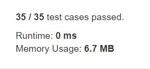

# 49. Group Anagrams
Given an integer array arr, count element x such that x + 1 is also in arr.  

If there're duplicates in arr, count them seperately.  

**Note**
You may not engage in multiple transactions at the same time (i.e., you must sell the stock before you buy again).  

**Example1:**   
```
Input: arr = [1,2,3]
Output: 2
Explanation: 1 and 2 are counted cause 2 and 3 are in arr.
```

**Example2:**   
```
Input: arr = [1,1,3,3,5,5,7,7]
Output: 0
Explanation: No numbers are counted, cause there's no 2, 4, 6, or 8 in arr.
```

**Example3:**   
```
Input: arr = [1,3,2,3,5,0]
Output: 3
Explanation: 0, 1 and 2 are counted cause 1, 2 and 3 are in arr.
```

**Example4:**   
```
Input: arr = [1,1,2,2]
Output: 2
Explanation: Two 1s are counted cause 2 is in arr.
```

## trial1
### Intuition
```
map에 arr에 존재하는 숫자들을 모두 삽입한 후에 arr[i]+1에 대한 숫자가 map에 존재하면 count를 1씩 증가시킨다.

After inserting all the numbers in "arr" into the map, if the number for arr [i] +1 exists in the map, the count(cnt) is incremented by 1.
```
### Codes  
```cpp
class Solution {
public:
	int countElements(vector<int>& arr) {
		unordered_map<int, int> m;
		int cnt = 0;
		for (int i = 0; i < arr.size(); i++) {
			m[arr[i]]++;
		}
		for (int i = 0; i < arr.size(); i++) {
			auto it = m.find(arr[i]+1);
			if (it != m.end()) {
				cnt++;
			}
		}
		return cnt;
	}
};
```

### Results (Performance)  
**Runtime:**  0 ms 
**Memory Usage:** 	6.7 MB

<p align="center"> 

</p>


### 문제 URL (LeetCode)  
https://leetcode.com/explore/challenge/card/30-day-leetcoding-challenge/528/week-1/3289/