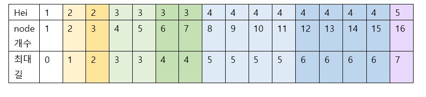
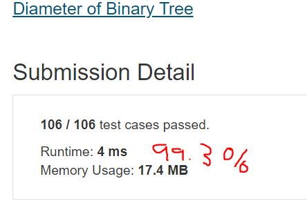

# Diameter of Binary Tree

Given a binary tree, you need to compute the length of the diameter of the tree. The diameter of a binary tree is the length of the longest path between any two nodes in a tree. This path may or may not pass through the root.  

**Example1:**   
Given a binary tree  
```
          1
         / \
        2   3
       / \     
      4   5 
```
## trial1
### Intuition
```
trial1은 문제에서 BST를 만들어내는 input 값에 NULL이 들어올 수 없다고 가정을 하고 푼 시도이다.
밑의 표와 같이 규칙이 있어서 그 규칙을 이용하여 코드를 작성하였다. NULL이 들어올수 없다고 가정할때 diameter의 최대 길이는 밑의 표와 같이 2*(height-1) 혹은 2*(height-1)-1가 된다 이것이 나눠지는 기준은 마지막 height의 edge들의 개수가 반을 넘느냐 혹은 넘지 않느냐이므로 이를 이용해서 계산을 하였다.


Trial 1 is an attempt to solve the assumption that NULL cannot be included in the input value that creates the BST in the problem.
There is a rule as shown in the table below, and the code is written using the rule. Assuming that NULL cannot be entered, the maximum length of diameter is 2 * (height-1) or 2 * (height-1) -1 as shown in the table below.

```
<p align="center"> 

</p>

### Codes  
```cpp
class Solution {
public:
	int diameterOfBinaryTree(TreeNode* root) {
		if (root == NULL) return 0;
		vector<TreeNode*> st;
		TreeNode *cur;
		st.push_back(root);
		int nodecnt = 0;
		while (!st.empty()) {//모든 node의 개수 세기
			cur= st.back();
			nodecnt++;
			st.pop_back();
			if (cur->left != NULL) {
				st.push_back(cur->left);
			}
			if (cur->right != NULL) {
				st.push_back(cur->right);
			}
		}
		int hei = log2((double)nodecnt);//height-1 값
		int dia = (hei * 2);//될수 있는 diameter
		int half = (pow(2, hei+1) - pow(2, hei)) / 2;//현재 레벨의 edge 개수의 반
		half += pow(2, hei);
		if (half > nodecnt) dia--;//현재 레벨의 edge의 반보다 작으면 diameter은 1이 작아야한다.
		return dia;
	}
};
```

### Results (Performance)  
Wrong Answer  
**Input**
```
[4,2,null,1,3]
```
**Output**
```
3
```
**Expected**
```
2
```

## trial2
### Intuition
```
밑의 코드는 TreeNode를 input과 같은 형식으로 다시 돌려놓은 후에 edge부터 root까지 올라가면서 최대 길의 개수를 찾도록 코드를 작성하였다.
최대 길의 개수는 밑에서부터 시작을 했을때 한쪽 방향에서의 최대 길의 개수에 1을 더한 값이라고 할 수 있다. 그러므로 이와같은 방식으로 점화식을 풀게 되면 오른쪽과 왼쪽의 최대 길의 개수의 합이 가장 큰 경우가 최종적인 diameter이 될수 있다.

The code below was written to return the TreeNode to the same format as input and then go up from the edge to the root to find the maximum number of paths.
The maximum number of roads can be said to be the maximum number of roads in one direction plus 1 when starting from the bottom. Therefore, if the ignition is solved in this way, the final diameter may be the case where the sum of the maximum number of paths on the right and left sides is the largest.
```
### Codes  
```cpp
class Solution {
public:
	int diameterOfBinaryTree(TreeNode* root) {
		if (root == NULL) return 0;
		int dia = 0,mx=0;
		vector<TreeNode*> st;
		TreeNode *cur;
		st.push_back(root);
		int i = 0;
		while (i<st.size()) {//위에서부터 left -> right 순서대로 vector에 집어 넣기
			cur = st[i];
			if (cur->left != NULL) {
				st.push_back(cur->left);
			}
			if (cur->right != NULL) {
				st.push_back(cur->right);
			}
			i++;
		}
		while (!st.empty()) {//st를 pop 하면서 진행
			cur = st.back();//가장 밑에 있는 node부터 진행
			st.pop_back();
			if (cur->left == NULL && cur->right == NULL) {//양쪽 자식 node가 모두 NULL이면 길이 0개인것으로 간주
				cur->val = 0;
			}
			else if (cur->left == NULL) {//right에만 길이 존재하면 길+1한 값을 현재 node의 길의 개수로 저장
				cur->val = cur->right->val + 1;
				mx = cur->val;//local maximum값 확인
			}
			else if (cur->right == NULL) {//left에만 길이 존재하면 left의 길+1한 값을 현재 node의 길의 개수로 저장
				cur->val = cur->left->val + 1;
				mx = cur->val;//local maximum 값
			}
			else {
				mx = cur->right->val + cur->left->val + 2;//양쪽 node 모두 길이 존재하면 모든 길의 개수의 합 + 각각 1씩 더하여 local mx값으로 지정
				cur->val = (cur->left->val <= cur->right->val ? cur->right->val + 1: cur->left->val + 1);// 양쪽 길 중에 길이가 긴 길값을 현재 node의 길값으로 지정
			}
			if (dia < mx) dia = mx;//dia는 maximum 길의 개수값
		}
		return dia;
	}
};
```

### Results (Performance)  
**Runtime:**  4 ms O(n)의 runtime을 가지고 있다.
**Memory Usage:** 	17.4 MB

<p align="center"> 

</p>


### 문제 URL (LeetCode)  
https://leetcode.com/problems/backspace-string-compare/