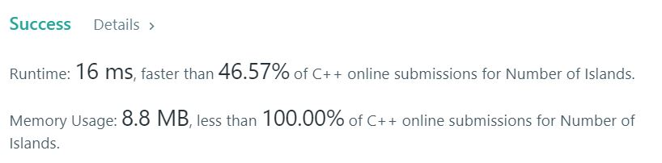
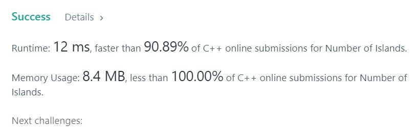

# 200. Number of Islands

Given a 2d grid map of '1's (land) and '0's (water), count the number of islands. An island is surrounded by water and is formed by connecting adjacent lands horizontally or vertically. You may assume all four edges of the grid are all surrounded by water.

**Example1:**   
```
Input:
11110
11010
11000
00000

Output: 1
```

**Example2:**   
```
Input:
11000
11000
00100
00011

Output: 3
```

## trial1
### Intuition
```
BFS를 이용하여 풀었습니다. 2중 for문을 돌려 모든 grid에 대하여 조사를 합니다. 만약에 '1'인경우에 새로운 땅이 존재하는 것으로 간주하여 cnt를 증가시키고 queue를 이용해 인접한 땅에 대하여 모두 0으로 변환합니다. 이런 땅들을 모두 방문하게 되면 cnt의 개수가 땅의 수라고 할 수 있습니다.

Solved using BFS. Turn the double for statement to check all grids. If it is '1', it is regarded as a new land, and the cnt is increased and the queue is converted to 0 for all adjacent lands. If you visit all these lands, you can say that the number of cnts is the number of lands.
```
### Codes  
```cpp
class Solution {
public:
	int numIslands(vector<vector<char>>& g) {
		int xx[4] = { 1,-1,0,0 }, yy[4] = { 0,0,1,-1 };
		int cnt = 0, nx, ny, x, y;
		if (g.size() == 0) return 0;
		int r = g.size(),c=g[0].size();

		queue<pair<int, int>> q;
		pair<int, int> cur;
		for (int i = 0; i < r; i++) {
			for (int j = 0; j < c; j++) {
				if (g[i][j] == '1') {
					cnt++;
					x = j; y = i;
					q.push(make_pair(y, x));
					while (!q.empty()) {
						cur = q.front();
						x = cur.second, y = cur.first;
						if (g[y][x] == '1') {
							g[y][x] = '0';
						}
						q.pop();
						for (int z = 0; z < 4; z++) {
							nx = x + xx[z]; ny = y + yy[z];
							if (nx >= 0 && nx < c && ny >= 0 && ny < r) {
								if (g[ny][nx] == '1') {
									q.push(make_pair(ny, nx));
									g[ny][nx]='0';
								}
							}
						}
					}
				}
			}
		}
		return cnt;
	}

};
```
### Results (Performance)  
**Runtime:**  16 ms  O(n^2)
**Memory Usage:** 	8.7 MB


<p align="center"> 

</p>

## trial2
### Intuition
```
DFS를 이용하여 모든 grid의 인덱스에 방문하여 '1'인 땅(새로운 땅)을 만날때마다 find 함수를 실행시켜 그 주변에 있는 땅에 대하여 visit를 진행합니다.
```
### Codes  
```cpp
class Solution {
public:
	vector<vector<char>> g;
	int ys, xs;
	int xx[4] = { 1,-1,0,0 }, yy[4] = { 0,0,1,-1 };
	void find(int y, int x) {
		if (x < 0 || x >= xs || y < 0 || y >= ys) return;
		if (g[y][x] == '0') return;
		g[y][x] = '0';
		for (int i = 0; i < 4; i++) {
			find(y + yy[i], x + xx[i]);
		}
		
	}
	int numIslands(vector<vector<char>>& g2) {
		ys = g2.size();
		if (g2.size() == 0)
			return 0;
		xs = g2[0].size();
		g = g2;
		int cnt = 0;
		for (int i = 0; i < ys; i++) {
			for (int j = 0; j < xs; j++) {
				if (g[i][j] == '1') {
					cnt++;
					find(i, j);
				}
			}
		}
		return cnt;
	}
};
```

### Results (Performance)  
**Runtime:**  12 ms  O(n)
**Memory Usage:** 	6.3 left의 개수와 star 개수만큼의 메모리를 추가로 사용 O(n-left-star)

<p align="center"> 

</p>


### 문제 URL (LeetCode)  
https://leetcode.com/problems/number-of-islands/