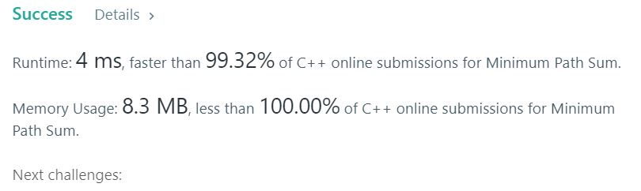

# 64. Minimum Path Sum

Given a m x n grid filled with non-negative numbers, find a path from top left to bottom right which minimizes the sum of all numbers along its path.  

**Note:** You can only move either down or right at any point in time.  

**Example1:**   
```
Input:
[
  [1,3,1],
  [1,5,1],
  [4,2,1]
]
Output: 7
Explanation: Because the path 1→3→1→1→1 minimizes the sum.
```


## trial1
### Intuition
```
right나 down으로만 움직일 수 있기 때문에 왼쪽에서 오른쪽으로 위에서 아래방향으로 순차적으로 값을 업데이트를 해주도록 하였다.
현재 인덱스의 값을 기준으로 왼쪽과 위쪽에 있는 값중 최소값을 이용하여 최단경로로 업데이트를 해준다.

Since it can only move to the right or down, the values ​​were sequentially updated from left to right and top to bottom.
Based on the value of the current index, the shortest path is updated using the minimum value from the left and top values.
```
### Codes  
```cpp
class Solution {
public:
	int minPathSum(vector<vector<int>>& g) {
		int xx[4] = { -1,0 }, yy[4] = { 0,-1 };
		int ny, nx,mi;
		for (int i = 0; i < g.size(); i++) {
			for (int j = 0; j < g[i].size(); j++) {
				mi = INT_MAX;
				for (int z = 0; z < 2; z++) {//위와 왼쪽중 작은 값 구하기
					ny = i + yy[z];
					nx = j + xx[z];
					if (nx >= 0 && nx < g[0].size() && ny >= 0 && ny < g.size()) {
						mi = min(g[ny][nx], mi);
					}
				}
				mi = (mi == INT_MAX ? 0: mi);
				g[i][j] = mi+g[i][j];
			}
		}
		return g.back().back();
	}
};
```
### Results (Performance)  
**Runtime:**  4 ms  O(n^2)
**Memory Usage:** 	8.3 MB


<p align="center"> 

</p>


### 문제 URL (LeetCode)  
https://leetcode.com/problems/minimum-path-sum/submissions/