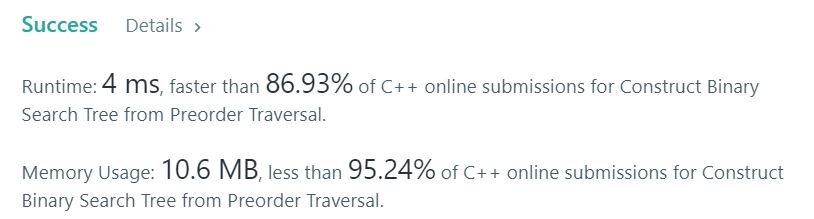

# 1008. Construct Binary Search Tree from Preorder Traversal

Return the root node of a binary search tree that matches the given preorder traversal.  

(Recall that a binary search tree is a binary tree where for every node, any descendant of node.left has a value < node.val, and any descendant of node.right has a value > node.val.  Also recall that a preorder traversal displays the value of the node first, then traverses node.left, then traverses node.right.)   

**Example1:**   
```
Input: [8,5,1,7,10,12]
Output: [8,5,10,1,7,null,12]
```


## trial1
### Intuition
```
right나 down으로만 움직일 수 있기 때문에 왼쪽에서 오른쪽으로 위에서 아래방향으로 순차적으로 값을 업데이트를 해주도록 하였다.
현재 인덱스의 값을 기준으로 왼쪽과 위쪽에 있는 값중 최소값을 이용하여 최단경로로 업데이트를 해준다.

Since it can only move to the right or down, the values ​​were sequentially updated from left to right and top to bottom.
Based on the value of the current index, the shortest path is updated using the minimum value from the left and top values.
```
### Codes  
```cpp
class Solution {
public:
	TreeNode* bstFromPreorder(vector<int>& p) {
		TreeNode * head;
		if (p.size() == 0) return NULL;
		head = new TreeNode(p[0]);
		TreeNode * cur,*prev=head;
		for (int i = 1; i < p.size(); i++) {
			cur = head;
			while (cur!=NULL) {
				prev = cur;
				if (p[i] < cur->val) {
					cur = cur->left;
				}
				else {
					cur = cur->right;
				}
			}
			if (p[i] < prev->val) {
				prev->left = new TreeNode(p[i]);
			}
			else {
				prev->right = new TreeNode(p[i]);
			}
		}
		return head;
	}
};
```
### Results (Performance)  
**Runtime:**  4 ms  O(nlogn) vector의 크기 n * tree의 높이 logn
**Memory Usage:** 	10.6 MB


<p align="center"> 

</p>


### 문제 URL (LeetCode)  
https://leetcode.com/problems/construct-binary-search-tree-from-preorder-traversal/