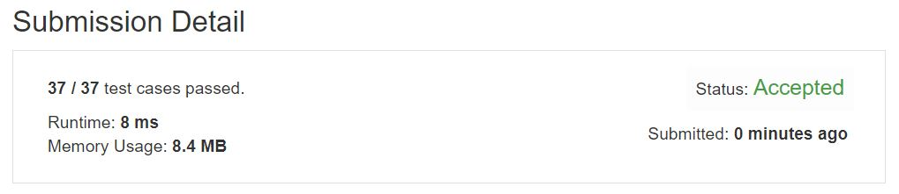

# Leftmost Column with at Least a One

This problem is an interactive problem.)  

A binary matrix means that all elements are 0 or 1. For each individual row of the matrix, this row is sorted in non-decreasing order.  

Given a row-sorted binary matrix binaryMatrix, return leftmost column index(0-indexed) with at least a 1 in it. If such index doesn't exist, return -1.   

You can't access the Binary Matrix directly.    You may only access the matrix using a BinaryMatrix interface:  

BinaryMatrix.get(x, y) returns the element of the matrix at index (x, y) (0-indexed).  
BinaryMatrix.dimensions() returns a list of 2 elements [n, m], which means the matrix is n * m.  
Submissions making more than 1000 calls to BinaryMatrix.get will be judged Wrong Answer.  Also, any solutions that attempt to circumvent the judge will result in disqualification.  

For custom testing purposes you're given the binary matrix mat as input in the following four examples. You will not have access the binary matrix directly.  

**Example1:**   
<p align="center"> 

</p>

```
Input: mat = [[0,0],[1,1]]
Output: 0
```

**Example2:**   
<p align="center"> 

</p>

```
Input: mat = [[0,0],[0,1]]
Output: 1
```

**Example3:**   
<p align="center"> 

</p>

```
Input: mat = [[0,0],[0,0]]
Output: -1
```

**Example4:**   
<p align="center"> 

</p>

```
Input: mat = [[0,0,0,1],[0,0,1,1],[0,1,1,1]]
Output: 1
```

## trial1
### Intuition
```
row=i이고 col=j라고 할때 맨오른쪽에 있는 인덱스부터 시작해서 1인 인덱스를 i를 증가시키면서 찾아낸다.
1을 찾아내게 되면 j를 맨 오른쪽에서 1이 끝날때까지 한칸씩 앞으로 온다.
그 1이 끝나게 되면 다시 i를 증가시키면서 1을 다시 탐색한다. 만약에 이때 1을 찾지 못하고 끝까지 내려오게 된다면 이때는 현재 column이 1이 맨 처음으로 나타나는 값이라는 것이다. 하지만 1을 찾아내게 된다면 현재 column보다 더 앞 column에 1이 있을 가능성이 있다는 뜻이다.
후자인 경우에는 1을 찾아낸 row에서 다시 column을 한칸씩 앞으로 옮기면서 1이 없을때까지 탐색을 하게 된다. 그리고 1이 끝나게 되는 지점에서 위의 방법을 다시 반복한다.


When row = i and col = j, starting at the far right index, find index which value is 1 by increasing i.
If it finds 1, it moves j one by one from the far right until 1 ends.  
When the 1 is over, it increments i again and searches for 1 again. If it does not find 1 at this time and it goes down to the end, it means that the current column is the value where 1 appears first. However, if it finds 1, it means that there is a possibility that there is 1 in the column before the current column.  
In the second case, the column is moved forward one space from the row where 1 was found, and the search is performed until there is no one. Then repeat the above method again at the point where 1 ends.
```
### Codes  
```cpp
class Solution {
public:
	int leftMostColumnWithOne(BinaryMatrix &b) {
		vector<int> a = b.dimensions();
		int y = a[0], x = a[1];
		int j = x - 1, i = 0;
		int cur;
		while (i < y) {
			cur = b.get(i, j);
			if (cur == 1) {
				while (1 <= j && cur == 1) {
					j--;
					cur = b.get(i, j);
				}
				if (cur == 1) return 0;
				else {
					j++;
				}
			}
			i++;
		}
		cur = b.get(i - 1, j);
		if (j == x - 1 && cur == 0) return -1;
		return j;
		
	}
};
```
### Results (Performance)  
**Runtime:**  8 ms 
**Memory Usage:** 	8.2 MB


<p align="center"> 

</p>


### 문제 URL (LeetCode)  
https://leetcode.com/explore/challenge/card/30-day-leetcoding-challenge/530/week-3/3306/