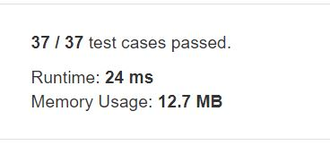

# Longest Common Subsequence

Given two strings text1 and text2, return the length of their longest common subsequence.  

A subsequence of a string is a new string generated from the original string with some characters(can be none) deleted without changing the relative order of the remaining characters. (eg, "ace" is a subsequence of "abcde" while "aec" is not). A common subsequence of two strings is a subsequence that is common to both strings.  

 

If there is no common subsequence, return 0.  

***Example1***
```
Input: text1 = "abcde", text2 = "ace" 
Output: 3  
Explanation: The longest common subsequence is "ace" and its length is 3.
```

***Example2***
```
Input: text1 = "abc", text2 = "abc"
Output: 3
Explanation: The longest common subsequence is "abc" and its length is 3.
```


***Example3***
```
Input: text1 = "abc", text2 = "def"
Output: 0
Explanation: There is no such common subsequence, so the result is 0.
```

***Constraints:***

1 <= text1.length <= 1000
1 <= text2.length <= 1000
The input strings consist of lowercase English characters only.


## trial1
### Intuition
```
두개의 string에 대하여 표를 만들어서 memoization을 이용하여 구현하였다.
```
### Codes  
```cpp
class Solution {
public:
	int longestCommonSubsequence(string text1, string text2) {
		vector<vector<int>> a(text1.size()+1,vector<int>(text2.size()+1,0));
		int i, j;
		text1 = " " + text1;
		text2 = " " + text2;
		for (i = 1; i < a.size(); i++) {
			for (j = 1; j < a[i].size(); j++) {
				if (text1[i] == text2[j]) {
					a[i][j] = a[i - 1][j - 1] + 1;
				}
				else {
					a[i][j] = max(a[i - 1][j], a[i][j - 1]);
				}
			}
		}
		return a[i - 1][j - 1];
	}
};
```
### Results (Performance)  
**Runtime:**  24 ms 
**Memory Usage:** 	12.7 MB


<p align="center"> 

</p>


### Discussion


### 문제 URL (LeetCode)  
https://leetcode.com/explore/challenge/card/30-day-leetcoding-challenge/531/week-4/3311/