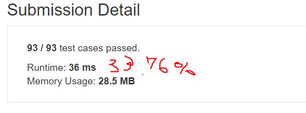

# Binary Tree Maximum Path Sum

Given a non-empty binary tree, find the maximum path sum.

For this problem, a path is defined as any sequence of nodes from some starting node to any node in the tree along the parent-child connections. The path must contain at least one node and does not need to go through the root.


## Example1
```
Input: [1,2,3]

       1
      / \
     2   3

Output: 6
```

## Example2
```
Input: [-10,9,20,null,null,15,7]

   -10
   / \
  9  20
    /  \
   15   7

Output: 42
```

## trial1
### Intuition
```
모든 node에 대하여 root 부터 왼쪽 오른쪽 순으로 vector v에 넣어준다.
v를 pop back 하면서 각 node에게 left와 right가 있는지 확인하여 child가 둘다 있는 경우 left와 right중 큰 값을 현재 parent에 더해주어야한다.
그리고 local maximum 값을 저장해준다.
child가 둘중 한곳이 NULL이라면 NULL이 아닌 child값을 더해줬을때 현재 parent보다 클 경우 업데이트를 해준다.

For all nodes, put them in vector v from root to right.
When popping v, check if each node has left and right, and if there are both children, the larger value of left and right should be added to the current parent.
And it stores local maximum value.
If one of the two children is NULL, if a child value that is not NULL is added, it is updated if it is larger than the current parent.
```
### Codes  
```cpp
class Solution {
public:
	vector<TreeNode*> v;
	int maxPathSum(TreeNode* root) {
		TreeNode * cur = root,lft,rgt;
		int i = 0;
		v.push_back(cur);
		for (; i < v.size(); i++) {
			cur = v[i];
			if(cur->left!=NULL) v.push_back(cur->left);
			if (cur->right != NULL) v.push_back(cur->right);
		}
		int largest = INT_MIN;
		int both = 0,sum=0;
		while (!v.empty()) {
			cur = v.back();
			v.pop_back();
			if (cur->right != NULL && cur->left != NULL) {
				both = cur->val + cur->left->val + cur->right->val;
				sum = (cur->left->val < cur->right->val ? cur->right->val : cur->left->val);
				cur->val =((sum+cur->val)<=cur->val?cur->val:sum+cur->val);
				if (largest < both) largest = both;
			}
			else if (cur->left != NULL) {
				if (cur->val < (cur->val + cur->left->val))
					cur->val += cur->left->val;
			}
			else if (cur->right!=NULL) {
				if (cur->val < (cur->val + cur->right->val))
					cur->val += cur->right->val;
			}
			if (largest < cur->val) largest = cur->val;
		}
		return largest;
	}
};
```
### Results (Performance)  
**Runtime:**   36 ms
**Memory Usage:** 	28.5 MB


<p align="center"> 

</p>


### 문제 URL (LeetCode)  
https://leetcode.com/problems/binary-tree-maximum-path-sum/