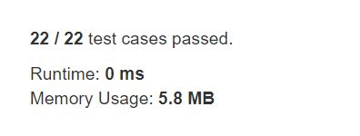

# First Bad Version

You are a product manager and currently leading a team to develop a new product. Unfortunately, the latest version of your product fails the quality check. Since each version is developed based on the previous version, all the versions after a bad version are also bad.  

Suppose you have n versions [1, 2, ..., n] and you want to find out the first bad one, which causes all the following ones to be bad.  

You are given an API bool isBadVersion(version) which will return whether version is bad. Implement a function to find the first bad version. You should minimize the number of calls to the API.  


## Example1

```
Given n = 5, and version = 4 is the first bad version.

call isBadVersion(3) -> false
call isBadVersion(5) -> true
call isBadVersion(4) -> true

Then 4 is the first bad version. 
```

## trial1
### Intuition
```
input 값의 순서에 따라서 BS를 하게 되면 값이 다르게 나와 처음에 n에 대하여 isBadVersion인지 아닌지 확인을 하였다.
그리고 BadVersion이 아닌경우에는 Binary Search를 사용하여 BadVersion인 값을 찾아주었다.


When BS was performed according to the order of input values, the bad version was different, so it should be first checked whether or not isBadVersion for n.
And in case it is not BadVersion, Binary Search was used to find the value that is BadVersion.
```
### Codes  
```cpp
class Solution {
public:
	int firstBadVersion(int n) {
		if (!isBadVersion(n)) return n;
		int lft=1, rgt=n;
		int p;
		while (lft <= rgt) {
			p = ceil((lft + rgt) / 2);
			if (isBadVersion(p)) {
				rgt = p - 1;
			}
			else {
				lft = p +1;
			}
		}
		return lft;
	}

};	
```

### Results (Performance)  
**Runtime:**   0 ms
**Memory Usage:** 	5.8 MB


<p align="center"> 

</p>


### 문제 URL (LeetCode)  
https://leetcode.com/explore/challenge/card/may-leetcoding-challenge/534/week-1-may-1st-may-7th/3316/