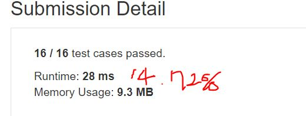
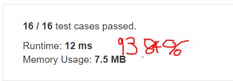

# 136. Single Number
Given a non-empty array of integers, every element appears twice except for one. Find that single one.

**Note:**

Your algorithm should have a linear runtime complexity. Could you implement it without using extra memory?
**Example1:**   
```
Input: [2,2,1]
Output: 1
```

**Example2:**   

```
Input: [4,1,2,1,2]
Output: 4
```

## trial1
### Intuition
```
unordered_map과 덧셈 뺄셈을 이용하여 값을 구하였다.
처음 숫자가 나올경우에는 p에 값을 더해주고 unorded_map에 값이 이미 존재하면 그 숫자는 두번 나왔다는 의미 이므로 p에 값을 뺄셈을 해주면 한번만 나온 값만 p에 남아있게 된다. 

The value was obtained using unordered_map and addition and subtraction.
When the number comes out for ones plus to the variable "p". If the value already exists in unorded_map, it means that the number comes out twice, so subtract it to the variable "p". Finally a number remaining at "p" is a single number.
```
### Codes  
```cpp
class Solution {
public:
	int singleNumber(vector<int>& nums) {
		unordered_map<int, bool> m;
		int p = 0;
		for (int i = 0; i < nums.size(); i++) {
			if(m.find(num[i])!=m.end()) p += nums[i];
			else p-=nums[i];
		}
		return p;
	}
};
```

### Results (Performance)  
**Runtime:**  28 ms (unordered_map의 search와 insert의 평균 시간은 O(1)이지만 worst case의 경우에는 O(n)이므로 O(n^2)가 됩니다.)
**Memory Usage:** 	9.6 MB

<p align="center"> 

</p>

## trial2 (다른 코드를 참고하여 작성함)
### Intuition
```
아래의 방법은 다른 확실한 linear time이 걸리는 방법을 찾으면서 발견한 방법이다.
XOR을 이용한 방법인데 숫자들을 bit 연산자를 통해서 두개의 숫자가 나오게 되면 두 값의 xor 0이 된다. 그러므로 마지막까지 남는 값은 숫자가 한번만 나온 값이 남게 되는 것이다.

The method below was found while looking for another code which takes linear time.
It is a method using XOR operator. When two numbers appear through the bit operator, the final value of two number will be 0. However if the number appears only ones, the result of xor operation will be 1. Threrfore, the value that remains until the end is the value where the number appears only once.
```
### Codes  
```cpp
class Solution {
public:
	int singleNumber(vector<int>& nums) {
		int p=nums[0];
        for (int i = 1; i < nums.size(); i++) {
			p^=nums[i];
		}
		return p;
	}
};
```

### Results (Performance)  
**Runtime:**  12 ms( 확실한 O(n) runtime이 된다.)
**Memory Usage:** 	7.5 MB

<p align="center"> 

</p>

### 문제 URL (LeetCode)  
https://leetcode.com/problems/single-number/