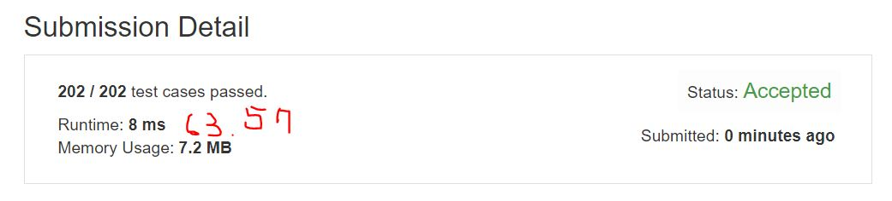

# 53. Maximum Subarray
Given an integer array nums, find the contiguous subarray (containing at least one number) which has the largest sum and return its sum.  

**Note**
If you have figured out the O(n) solution, try coding another solution using the divide and conquer approach, which is more subtle.  

**Example1:**   
```
Input: [-2,1,-3,4,-1,2,1,-5,4],
Output: 6
Explanation: [4,-1,2,1] has the largest sum = 6.
```

## trial1
### Intuition
```
linear time에 결과값을 구하기 위해서는 반복문을 한번 돌려서 현재 subarray의 합값과 전체에서 최대의 subarray의 합값에 대한 변수를 각각 lar, alllar로 두고 진행한다.

In order to obtain the result value in linear time, the loop is rotated once and the variables for the sum of the current subarray and the sum of the largest subarrays are set to lar and alllar respectively.
```
### Codes  
```cpp
class Solution {
public:
	int maxSubArray(vector<int>& n) {
		long long lar = -INT_MAX,alllar=-INT_MAX;
		for (int i = 0; i < n.size(); i++) {
			if (lar + n[i] > n[i]) {//현재 값보다 현재 subarray의 large값에 현재값을 더한값이 더 큰경우 (subarray에 요소가 추가되는경우)
				lar += n[i];//현재 값을 large에 더한다.
			}
			else {//아니라면 subarray의 시작인덱스가 다시 업데이트 된다.(subarray의 large값도 다시 시작인덱스의 값으로 갱신)
				lar = n[i];
			}
			if (lar > alllar) {//전체적으로 가장 큰 subaaray의 합을 업데이트
				alllar = lar;
			}
		}
		return alllar;
	}
};
```

### Results (Performance)  
**Runtime:**  8 ms
**Memory Usage:** 	7.2 MB

<p align="center"> 

</p>


### 문제 URL (LeetCode)  
https://leetcode.com/problems/maximum-subarray/