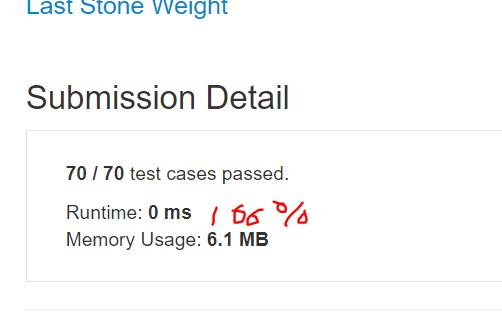

# Last Stone Weight

We have a collection of stones, each stone has a positive integer weight.

Each turn, we choose the two heaviest stones and smash them together.  Suppose the stones have weights x and y with x <= y.  The result of this smash is:

If x == y, both stones are totally destroyed;
If x != y, the stone of weight x is totally destroyed, and the stone of weight y has new weight y-x.
At the end, there is at most 1 stone left.  Return the weight of this stone (or 0 if there are no stones left.)

**Note**

1 <= stones.length <= 30
1 <= stones[i] <= 1000

**Example1:**   
```
Input: [2,7,4,1,8,1]
Output: 1
Explanation: 
We combine 7 and 8 to get 1 so the array converts to [2,4,1,1,1] then,
we combine 2 and 4 to get 2 so the array converts to [2,1,1,1] then,
we combine 2 and 1 to get 1 so the array converts to [1,1,1] then,
we combine 1 and 1 to get 0 so the array converts to [1] then that's the value of last stone.
```

## trial1
### Intuition
```
max heap을 이용하여 코드를 구현하였다.
max heap인 "p"에 모든 vector값들을 넣고 첫번째와 두번째로 큰값들끼리 값이 다른경우 두 수의 차를 max heap에 다시 넣어주어 p안에 값이 1이거나 없는 경우까지 진행한다.

Code was implemented using max heap.
If all the vector values ​​are put in the "p" of the max heap and the values ​​between the first and second largest values ​​are different, the difference between the two numbers is put back into the max heap until the value in p is 1 or not.
```
### Codes  
```cpp
class Solution {
public:
	int lastStoneWeight(vector<int>& stones) {
		priority_queue<int, vector<int>, less<int>> p;
		for (int i = 0; i < stones.size(); i++) {
			p.push(stones[i]);
		}
		int a, b;
		while (!p.empty() && p.size() > 1) {
			a = p.top();
			p.pop();
			b = p.top();
			p.pop();
			if (a != b) {
				p.push(abs(a - b));
			}
		}
		return (p.empty() ? 0 : p.top());
	}
};
```

### Results (Performance)  
**Runtime:**  0 ms O(n)의 runtime을 가지고 있다.
**Memory Usage:** 	6.3 MB

<p align="center"> 

</p>


### 문제 URL (LeetCode)  
https://leetcode.com/explore/challenge/card/30-day-leetcoding-challenge/529/week-2/3297/