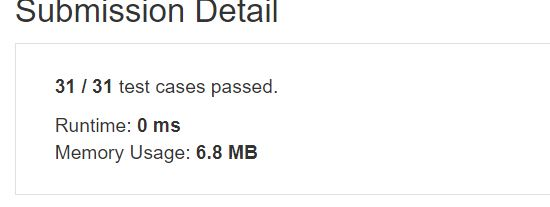

# Perform String Shifts

You are given a string s containing lowercase English letters, and a matrix shift, where shift[i] = [direction, amount]:  

direction can be 0 (for left shift) or 1 (for right shift).   
amount is the amount by which string s is to be shifted.  
A left shift by 1 means remove the first character of s and append it to the end.  
Similarly, a right shift by 1 means remove the last character of s and add it to the beginning.  
Return the final string after all operations.  

**Note**

1 <= s.length <= 100  
s only contains lower case English letters.  
1 <= shift.length <= 100  
shift[i].length == 2  
0 <= shift[i][0] <= 1  
0 <= shift[i][1] <= 100  

**Example1:**   
```
Input: s = "abc", shift = [[0,1],[1,2]]
Output: "cab"
Explanation: 
[0,1] means shift to left by 1. "abc" -> "bca"
[1,2] means shift to right by 2. "bca" -> "cab"
```

**Example2:** 
```
Input: s = "abcdefg", shift = [[1,1],[1,1],[0,2],[1,3]]
Output: "efgabcd"
Explanation:  
[1,1] means shift to right by 1. "abcdefg" -> "gabcdef"
[1,1] means shift to right by 1. "gabcdef" -> "fgabcde"
[0,2] means shift to left by 2. "fgabcde" -> "abcdefg"
[1,3] means shift to right by 3. "abcdefg" -> "efgabcd"
```

## trial1
### Intuition
```
"tmp"라는 string을 추가하였다. right shift일 때는 뒤에서 shift하는 값을 뺀 index(j)부터 차례로 "tmp"에 더해준다.
"j"가 string size일 경우 인덱스 범위를 넘어가므로 0으로 바꾼다.
left는 right와 반대로 0번째 인덱스에서 shift 하는 수만큼 "j"를 뒤로 보내고 그 인덱스부터 시작하여 "tmp"가 "s"의 사이즈를 만족할때까지 "tmp"에 한 글자씩 넣어준다. 마찬가지로 j가 string size인 경우 0으로 바꿔준다.

The string "tmp" is used in this code. When it is right shift, add to "tmp" in order from index (j) minus the shift value from the back.
If "j" is a string size, it is changed to 0 because it exceeds the index range.
For the Left shift, sends "j" backward by the number of shifts from the 0th index, starting at that index, and inserting one character into "tmp" until "tmp" satisfies the size of "s". Similarly, if j is a string size, it is replaced with 0.
```
### Codes  
```cpp
class Solution {
public:
	string stringShift(string s, vector<vector<int>>& shi) {
		string tmp;
		for (int i = 0; i < shi.size(); i++) {
			tmp = "";
			if (shi[i][0]) {//right shift
				for (int j = s.size() - shi[i][1]; tmp.size() < s.size(); j++) {
					if (j == s.size()) j = 0;
					tmp += s[j];
				}
				s = tmp;
			}
			else {//left shift
				for (int j = 0 + shi[i][1]; tmp.size() < s.size(); j++) {
					if (j == s.size()) j = 0;
					tmp += s[j];
				}
				s = tmp;
			}
		}
		return s;
	}
};
```

### Results (Performance)  
**Runtime:**  0 ms shi size를 k로 두고 string s의 size를 n이라고 할때 O(kn)만큼 걸린다.
**Memory Usage:** 	6.3 MB

<p align="center"> 

</p>


### 문제 URL (LeetCode)  
https://leetcode.com/explore/challenge/card/30-day-leetcoding-challenge/529/week-2/3297/