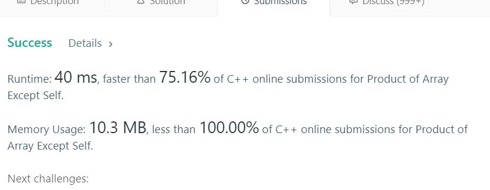

# 238. Product of Array Except Self

Given an array nums of n integers where n > 1,  return an array output such that output[i] is equal to the product of all the elements of nums except nums[i].  

**Constraint**
: It's guaranteed that the product of the elements of any prefix or suffix of the array (including the whole array) fits in a 32 bit integer.

Note: Please solve it without division and in O(n).

**Follow up:**
Could you solve it with constant space complexity? (The output array does not count as extra space for the purpose of space complexity analysis.)

**Example1:**   
```
Input:  [1,2,3,4]
Output: [24,12,8,6]
```

## trial1
### Intuition
```
st와 lst는 각각 i번째 있는 값과 뒤에서 i번째 인덱스에 값을 차례대로 곱해가는 값이다. 현재 res의 i와 뒤에서 i번째 인덱스의 값을 st와 lst가 nums[i]를 곱하기전에 곱셈을 진행하여 현재 값을 제외하고 업데이트를 해주게 되면 자기자신을 제외한 모든값에 대한 곱셈의 arr로 만들 수 있다.

"st" and "lst" are values ​​that multiply the i-th value and the i-th index from the back, respectively. Current i-th index of "res" and the value of the i-th index from the back of "res" should be updated before "st" and "lst" is updated, so that all the numbers of "res" will be result of multiplication of all the numbers except for the current value itself.
```
### Codes  
```cpp
class Solution {
public:
	vector<int> productExceptSelf(vector<int>& nums) {
		vector<int> res(nums.size(),1);
		int lst = 1, st = 1, ridx = 0;
		for (int i = 0; i < nums.size(); i++) {
			res[i] *= st;
			st *= nums[i];
			ridx = nums.size() - 1 - i;
			res[ridx] *= lst;
			lst *= nums[ridx];
		}
		return res;
	}
};
```

### Results (Performance)  
**Runtime:**  40 ms  O(n)
**Memory Usage:** 	10.3 MB res와 lst,st,ridx가 있으므로 O(n+3)이므로 O(n)

<p align="center"> 

</p>


### 문제 URL (LeetCode)  
https://leetcode.com/problems/product-of-array-except-self/