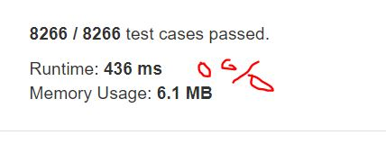

# Bitwise AND of Numbers Range

Given a range [m, n] where 0 <= m <= n <= 2147483647, return the bitwise AND of all numbers in this range, inclusive.

```
Input: [5,7]
Output: 4
```

```
Input: [0,1]
Output: 0
```

## trial1
### Intuition
```
ans에 m 숫자를 넣어놓고 그뒤로 계속 &을 해주게 된다. 만약에 0이 되는 경우에는 0을 리턴해준다.
m과 n은 최대치가 2147483647이기 때문에 longlong형으로 i와 ans를 선언해야 한다.


I put m number in ans, and it keeps & after. If it becomes 0, 0 is returned.
Since m and n have a maximum value of 2147483647, i and ans must be declared in longlong form.
```
### Codes  
```cpp
class Solution {
public:
	int rangeBitwiseAnd(int m, int n) {
		long long ans=m;
		for (long long i = (long long)m+1; i <= n; i++) {
			if (ans == 0) return 0;
			ans = ans & i;
		}
		return ans;
	}
};
```
### Results (Performance)  
**Runtime:**  436 ms 
**Memory Usage:** 	6.1 MB


<p align="center"> 

</p>


### Discussion
```cpp
class Solution {
public:
	int rangeBitwiseAnd(int m, int n) {
		while (m < n) {  // Remove the last bit 1 until n <= m.
            n &= n - 1;
        }
        return n;
	}
};
```

### 문제 URL (LeetCode)  
https://leetcode.com/explore/challenge/card/30-day-leetcoding-challenge/531/week-4/3308/