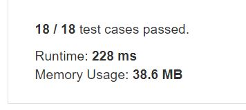

# Bitwise AND of Numbers Range

Design and implement a data structure for Least Recently Used (LRU) cache. It should support the following operations: get and put.  

get(key) - Get the value (will always be positive) of the key if the key exists in the cache, otherwise return -1.  
put(key, value) - Set or insert the value if the key is not already present. When the cache reached its capacity, it should invalidate the least recently used item before inserting a new item.  

The cache is initialized with a positive capacity.

Follow up: Could you do both operations in O(1) time complexity?

```
LRUCache cache = new LRUCache( 2 /* capacity */ );

cache.put(1, 1);
cache.put(2, 2);
cache.get(1);       // returns 1
cache.put(3, 3);    // evicts key 2
cache.get(2);       // returns -1 (not found)
cache.put(4, 4);    // evicts key 1
cache.get(1);       // returns -1 (not found)
cache.get(3);       // returns 3
cache.get(4);       // returns 4
```

## trial1
### Intuition
```
ans에 m 숫자를 넣어놓고 그뒤로 계속 &을 해주게 된다. 만약에 0이 되는 경우에는 0을 리턴해준다.
m과 n은 최대치가 2147483647이기 때문에 longlong형으로 i와 ans를 선언해야 한다.


I put m number in ans, and it keeps & after. If it becomes 0, 0 is returned.
Since m and n have a maximum value of 2147483647, i and ans must be declared in longlong form.
```
### Codes  
```cpp
class LRUCache {
public:
	int cap = 0;
	int sq = 0;
	map<int, pair<int,int>> k;
	map<int, int> s;
	LRUCache(int capacity) {
		cap = capacity;
	}

	int get(int key) {
		if (k.find(key) == k.end()) return -1;
		int bv = k[key].second;
		int bs = k[key].first;
		k[key].first = sq;
		s.erase(bs);
		s[sq++] = key;
		return bv;
	}

	void put(int key, int value) {
		if (k.find(key) != k.end()) {//존재하는경우
			int ss = k[key].first;
			s.erase(ss);
		}
		k[key] = make_pair(sq,value);
		s[sq++] = key;
		if (k.size() > cap) {
			auto it = s.begin();
			int erk = it->second;
			int ers = it->first;
			k.erase(erk);
			s.erase(ers);
		}
	}
};
```
### Results (Performance)  
**Runtime:**  436 ms 
**Memory Usage:** 	6.1 MB


<p align="center"> 

</p>


### Discussion
```cpp
class Solution {
public:
	int rangeBitwiseAnd(int m, int n) {
		while (m < n) {  // Remove the last bit 1 until n <= m.
            n &= n - 1;
        }
        return n;
	}
};
```

### 문제 URL (LeetCode)  
https://leetcode.com/problems/lru-cache/