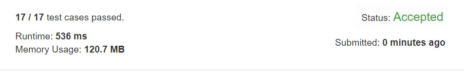

# First Unique Number

You have a queue of integers, you need to retrieve the first unique integer in the queue.  

Implement the FirstUnique class:  

```
FirstUnique(int[] nums) Initializes the object with the numbers in the queue.  
int showFirstUnique() returns the value of the first unique integer of the queue, and returns -1 if there is no such integer.  
void add(int value) insert value to the queue.  
```

## Example1
```
Input: 
["FirstUnique","showFirstUnique","add","showFirstUnique","add","showFirstUnique","add","showFirstUnique"]
[[[2,3,5]],[],[5],[],[2],[],[3],[]]
Output: 
[null,2,null,2,null,3,null,-1]

Explanation: 
FirstUnique firstUnique = new FirstUnique([2,3,5]);
firstUnique.showFirstUnique(); // return 2
firstUnique.add(5);            // the queue is now [2,3,5,5]
firstUnique.showFirstUnique(); // return 2
firstUnique.add(2);            // the queue is now [2,3,5,5,2]
firstUnique.showFirstUnique(); // return 3
firstUnique.add(3);            // the queue is now [2,3,5,5,2,3]
firstUnique.showFirstUnique(); // return -1
```

## Example1
```
Input: 
["FirstUnique","showFirstUnique","add","add","add","add","add","showFirstUnique"]
[[[7,7,7,7,7,7]],[],[7],[3],[3],[7],[17],[]]
Output: 
[null,-1,null,null,null,null,null,17]

Explanation: 
FirstUnique firstUnique = new FirstUnique([7,7,7,7,7,7]);
firstUnique.showFirstUnique(); // return -1
firstUnique.add(7);            // the queue is now [7,7,7,7,7,7,7]
firstUnique.add(3);            // the queue is now [7,7,7,7,7,7,7,3]
firstUnique.add(3);            // the queue is now [7,7,7,7,7,7,7,3,3]
firstUnique.add(7);            // the queue is now [7,7,7,7,7,7,7,3,3,7]
firstUnique.add(17);           // the queue is now [7,7,7,7,7,7,7,3,3,7,17]
firstUnique.showFirstUnique(); // return 17
```

## trial1
### Intuition
```
queue와 map을 이용하여 초기화 시에는 map과 queue에 전부 넣어준다. 그리고 showFirstUnique 함수에서는 q에서 앞에 있는 값이 한개만 있는 경우를 map을 이용하여 판단하고 1이상이면 더이상 불려질 일이 없으므로 q에서 pop을 해준다. 값이 1이면 해당 값을 return 하고 queue가 비어있을때까지 진행해도 리턴을 못한다면 마지막에 -1을 리턴한다. 
add 함수에서는 map 안에 값이 이미 존재한 경우에는 현재 개수 값에 1올려주고 아닌경우에는 queue에 추가한다. 

When initializing using queues and maps, put them all numbers in maps and queues. And in the "showFirstUnique" function, if there is unique number which is judged by using map, return the front number. If count of the number is greater than 1, the number will be popped up because q is no longer called. If the queue poped front until the queue is empty, -1 is returned.
In the add function, if a value already exists in the map, it is rounded up to the current count value, and if not, it is added to the queue.
```
### Codes  
```cpp
class FirstUnique {
public:
	unordered_map<int, int> a;
	queue<int> q;
	FirstUnique(vector<int>& nums) {
		for (int i = 0; i < nums.size();i++) {
			a[nums[i]]++;
			q.push(nums[i]);
		}
	}

	int showFirstUnique() {
		int i = -1;
		while (!q.empty()) {
			i = q.front();
			if (a[i] > 1) {
				q.pop();
			}
			else if (a[i] == 1) {
				return i;
			}
		}
		return -1;
	}

	void add(int value) {
		if(a[value]++==0)
			q.push(value);
	}
};
```
### Results (Performance)  
**Runtime:**   536 ms 
**Memory Usage:** 	120.7 MB


<p align="center"> 

</p>


### 문제 URL (LeetCode)  
https://leetcode.com/explore/challenge/card/30-day-leetcoding-challenge/531/week-4/3313/