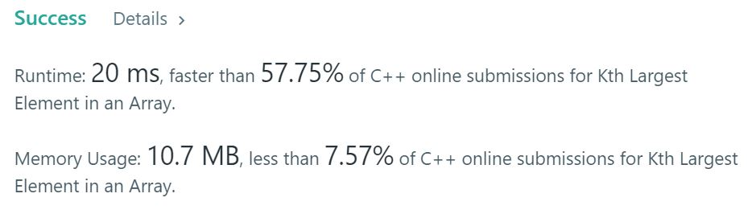

# 215. Kth Largest Element in an Array
Find the kth largest element in an unsorted array. Note that it is the kth largest element in the sorted order, not the kth distinct element.

## Example1

```
Input: [3,2,1,5,6,4] and k = 2
Output: 5
```

## Example2

```
Input: [3,2,3,1,2,4,5,5,6] and k = 4
Output: 4
```

## trial1
### Intuition
```
heap(priority queue)에 각 요소들을 넣고 k-1번만큼 뺀다. 그 후에 k번째 있는 값이 top에 있으므로 그것을 return 한다.


Put each element in the heap (priority queue) and subtract it by k-1 times. After that, since the kth value is at the top, return it.
```
### Codes  
```cpp
class Solution {
public:
    Solution() { ios::sync_with_stdio(false); std::cin.tie(nullptr); std::cout.tie(nullptr); }
    int findKthLargest(vector<int>& n, int k) {
        priority_queue<int, vector<int>, less<int>> q;
        for (int i = 0; i < n.size(); i++) {
            q.push(n[i]);
        }
        for (int i = 1; i < k; i++) {
            q.pop();
        }
        return q.top();
    }
};
```

### Results (Performance)  
**Runtime:**  20 ms (nlogn)  
**Memory Usage:** 	10.7 MB  


<p align="center"> 

</p>


### 문제 URL (LeetCode)  
https://leetcode.com/problems/kth-largest-element-in-an-array/