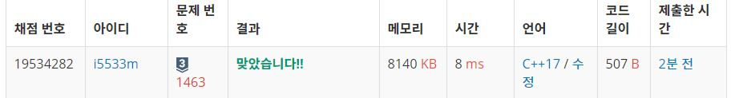

# 1로 만들기

정수 X에 사용할 수 있는 연산은 다음과 같이 세 가지 이다.  

X가 3으로 나누어 떨어지면, 3으로 나눈다.  
X가 2로 나누어 떨어지면, 2로 나눈다.  
1을 뺀다.  
정수 N이 주어졌을 때, 위와 같은 연산 세 개를 적절히 사용해서 1을 만들려고 한다. 연산을 사용하는 횟수의 최솟값을 출력하시오.   


**입력**  
첫째 줄에 1보다 크거나 같고, 106보다 작거나 같은 정수 N이 주어진다.       

**출력**  
첫째 줄에 연산을 하는 횟수의 최솟값을 출력한다.   

**Example1:**   
```
2

1
```

**Example2:**   
```
10

3
```

## trial1
### Intuition
```
DP를 사용하여 문제를 해결하였다. 
1의 경우에는 0번으로 1을 만들 수 있고 2와 3인 경우에는 1번이다. 이제 4부터는 미리 정의를 해놓은 이 값으로 답을 찾아야 한다. 4는 2의 배수이므로 2를 1로 만들기 위한 횟수에 1번 더 연산을 해야한다. 
5의 경우에는 2와 3의 배수가 모두 아니므로 5에서 -1한 값인 4를 연산하는 횟수에 한번 더 연산하면 된다. 이를 반복하여 input 값까지 값을 구하게 되면 input를 1로 만들기 위한 연산의 횟수를 구할 수 있게 된다.
```


### Codes  
```cpp
int input = 0,cnt=0;
int main() {
	vector<int> v;
	v.push_back(0);//0인경우
	v.push_back(0);//1
	v.push_back(1);//2
	v.push_back(1);//3
	cin >> input;
	int mi;
	for (int i = 4; i <= input; i++) {
		mi = 1000001;
		if (i % 3 == 0) {
			mi = v[i / 3] + 1;
		}
		if (i % 2 == 0) {
			mi = min(mi, v[i / 2] + 1);
		}
		mi=min(mi,v[i - 1] + 1);
		v.push_back(mi);
	}
	cout << v[input];
	return 0;
}
```

### Results (Performance)    
**Runtime:**  8 ms   
**Memory Usage:** 	8140 MB    


<p align="center"> 

</p>


### 문제 URL (백준)  
https://www.acmicpc.net/problem/1463