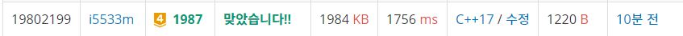

# 연속합

세로 R칸, 가로 C칸으로 된 표 모양의 보드가 있다. 보드의 각 칸에는 대문자 알파벳이 하나씩 적혀 있고, 좌측 상단 칸 (1행 1열) 에는 말이 놓여 있다.  

말은 상하좌우로 인접한 네 칸 중의 한 칸으로 이동할 수 있는데, 새로 이동한 칸에 적혀 있는 알파벳은 지금까지 지나온 모든 칸에 적혀 있는 알파벳과는 달라야 한다. 즉, 같은 알파벳이 적힌 칸을 두 번 지날 수 없다.  

좌측 상단에서 시작해서, 말이 최대한 몇 칸을 지날 수 있는지를 구하는 프로그램을 작성하시오. 말이 지나는 칸은 좌측 상단의 칸도 포함된다.  

**입력**  
첫째 줄에 R과 C가 빈칸을 사이에 두고 주어진다. (1 ≤ R,C ≤ 20) 둘째 줄부터 R개의 줄에 걸쳐서 보드에 적혀 있는 C개의 대문자 알파벳들이 빈칸 없이 주어진다.      

**출력**  
첫째 줄에 말이 지날 수 있는 최대의 칸 수를 출력한다.      


**Example1:**   
```
2 4
CAAB
ADCB

3
```

## trial1
### Intuition
```
DFS문제로 visit를 2개를 사용해서 알파벳의 중복 여부를 확인하고 좌표의 방문 여부를 체크하면서 진행하였다.
dfs함수의 첫번째 조건문은 만약에 모든 좌표의 알파벳이 다 다른경우에 대해서 처리를 해주었다.
두번째 조건문은 만약에 중복된 알파벳을 만난 경우에는 cnt보다 step수의 -1보다 가 더 큰경우 업데이트를 해준다.
세번째 else문에서는 사방을 탐색하는 작업을 진행하였다. visit는 현재 방문한 알파벳 방문 표시를 위한 것이고
visit2는 좌표에 대한 방문을 표시하기 위함이다. 
visit는 사방을 탐색하기전에 true로 바꾸고 사방 탐색 후에 다시 false로 바꾼다.
visit2는 dfs함수를 들어가기 직전에 다음 좌표값에 대해서 true로 바꾸고 dfs에서 나왔을때 false로 바꾼다.
```

### Codes  
```cpp
char arr[21][21];
int r, c;
int xx[4] = { 0,0,1,-1 };
int yy[4] = { 1,-1,0,0 };
int cnt = 0;
struct block {
	int x, y;
	char c;
};
vector<bool> visit(26,false);
bool visit2[21][21] = { false, };
void dfs(block cur,int stp) {
	if (stp == (r*c) && !visit[cur.c - 'A']) {
		cnt = stp;
	}
	if (visit[cur.c - 65]) {
		if ((stp - 1) > cnt) cnt = stp - 1;//현재 step이 가장 크다면
	}
	else {
		int nx, ny;
		visit[cur.c - 65] = true;//현재 알파벳 방문표시
		for (int i = 0; i < 4; i++) {
			nx = cur.x + xx[i];
			ny = cur.y + yy[i];
			if (nx >= 0 && ny >= 0 && nx < c && ny < r) {
				if (!visit2[ny][nx]) {
					visit2[ny][nx] = true;
					block b;
					b.x = nx;
					b.y = ny;
					b.c = arr[ny][nx];
					dfs(b, stp + 1);
					visit2[ny][nx] = false;//방문했다가 다시 안방문하기
				}
			}
		}
		visit[cur.c - 65] = false;
		
	}
}
```

### Results (Performance)    
**Runtime:**  1756 ms   
**Memory Usage:** 	1984 kB    


<p align="center"> 

</p>


### 문제 URL (백준)  
https://www.acmicpc.net/problem/1912