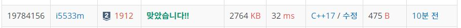

# 연속합

n개의 정수로 이루어진 임의의 수열이 주어진다. 우리는 이 중 연속된 몇 개의 수를 선택해서 구할 수 있는 합 중 가장 큰 합을 구하려고 한다. 단, 수는 한 개 이상 선택해야 한다.  

예를 들어서 10, -4, 3, 1, 5, 6, -35, 12, 21, -1 이라는 수열이 주어졌다고 하자. 여기서 정답은 12+21인 33이 정답이 된다.  

**입력**  
첫째 줄에 정수 n(1 ≤ n ≤ 100,000)이 주어지고 둘째 줄에는 n개의 정수로 이루어진 수열이 주어진다.  
수는 -1,000보다 크거나 같고, 1,000보다 작거나 같은 정수이다.        

**출력**  
첫째 줄에 답을 출력한다.    


**Example1:**   
```
10
10 -4 3 1 5 6 -35 12 21 -1

33
```

**Example2:**   
```
10
2 1 -4 3 4 -4 6 5 -5 1

14
```

## trial1
### Intuition
```
DP 문제로 이전 합(cursum)에 현재값을 더한 것이 현재 요소보다 작다면 현재 값이 cursum이 되고 아니라면 
cursum에 현재값을 더한것으로 업데이트를 해준다.
그리고 만약에 전체중에 가장 큰 값을 구하기 위해서는 cursum으로 계속 대소 비교를 해서 업데이트를 해주어야한다.
```

### Codes  
```cpp
int main() {
	//freopen("연속합.txt", "r", stdin);
	int ct = 0,tmp,cursum=-1001,tsum=-1001;
	cin >> ct;
	for (int i = 0; i < ct; i++) {
		cin >> tmp;
		arr.push_back(tmp);
	}
	for (int i = 0; i < arr.size(); i++) {
		if (cursum + arr[i] > arr[i]) cursum += arr[i];
		else cursum = arr[i];
		if (tsum < cursum) tsum = cursum;
	}
	cout << tsum << endl;
	return 0;
}
```

### Results (Performance)    
**Runtime:**  32 ms   
**Memory Usage:** 	2764 kB    


<p align="center"> 

</p>


### 문제 URL (백준)  
https://www.acmicpc.net/problem/1912