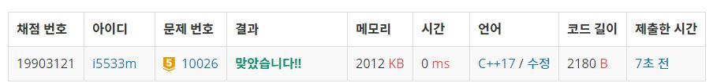

# 적록색약

적록색약은 빨간색과 초록색의 차이를 거의 느끼지 못한다. 따라서, 적록색약인 사람이 보는 그림은 아닌 사람이 보는 그림과는 좀 다를 수 있다.  

크기가 N×N인 그리드의 각 칸에 R(빨강), G(초록), B(파랑) 중 하나를 색칠한 그림이 있다. 그림은 몇 개의 구역으로 나뉘어져 있는데, 구역은 같은 색으로 이루어져 있다. 또, 같은 색상이 상하좌우로 인접해 있는 경우에 두 글자는 같은 구역에 속한다. (색상의 차이를 거의 느끼지 못하는 경우도 같은 색상이라 한다)  

예를 들어, 그림이 아래와 같은 경우에  
```
RRRBB
GGBBB
BBBRR
BBRRR
RRRRR
```
적록색약이 아닌 사람이 봤을 때 구역의 수는 총 4개이다. (빨강 2, 파랑 1, 초록 1) 하지만, 적록색약인 사람은 구역을 3개 볼 수 있다. (빨강-초록 2, 파랑 1)  

그림이 입력으로 주어졌을 때, 적록색약인 사람이 봤을 때와 아닌 사람이 봤을 때 구역의 수를 구하는 프로그램을 작성하시오.  

**입력**  
첫째 줄에 N이 주어진다. (1 ≤ N ≤ 100)  

둘째 줄부터 N개 줄에는 그림이 주어진다.         

**출력**  
적록색약이 아닌 사람이 봤을 때의 구역의 개수와 적록색약인 사람이 봤을 때의 구역의 수를 공백으로 구분해 출력한다.  


**Example1:**   
```
5
RRRBB
GGBBB
BBBRR
BBRRR
RRRRR

4 3
```


## trial1
### Intuition
```
BFS를 사용하여 적록색약이 아닌 사람에 대한 find 함수와 적록색약인 사람의 find함수를 두개 만들어서 구현하였다.
적록색약이 아닌사람은 그냥 보통 BFS와 비슷한 방법이므로 생략하겠다.
적록색약인 사람의 BFS는 아래와 같이 Blue인 경우에 대해서 처리를 해주어야한다.
Blue의 캐릭터인 경우 주변에 Blue인 경우에만 visit를 true로 만들어준다.
그리고 나머지 Red 와 Green의 경우에는 둘이 같은 경우로 치고 Blue가 아닌 경우에는 사방탐색을 할때 방문이 가능
하도록 하여 visit를 true로 만든다. 이렇게 하면 find를 할때마다 cnt를 각각 올려주기 때문에
색의 영역의 개수를 각각 구할 수 있다.
```

### Codes  
```cpp
void find2() {
	int nx, ny;
	col cur;
	while (!q.empty()) {
		cur = q.front();
		q.pop();
		for (int i = 0; i < 4; i++) {
			nx = cur.x + xx[i];
			ny = cur.y + yy[i];
			if (nx >= 0 && ny >= 0 && nx < n && ny < n) {
				if (cur.c == 'B') {//blue를 제외하고는 모두 같은것으로 취급
					if (arr[ny][nx] == cur.c && !visit2[ny][nx]) {//같고 visit 안한부분
						visit2[ny][nx] = true;
						col nw;
						nw.c = cur.c;
						nw.x = nx;
						nw.y = ny;
						q.push(nw);
					}
				}
				else {
					if (arr[ny][nx] !='B' && !visit2[ny][nx]) {//같고 visit 안한부분
						visit2[ny][nx] = true;
						col nw;
						nw.c = cur.c;
						nw.x = nx;
						nw.y = ny;
						q.push(nw);
					}
				}
			}
		}
	}
}
```

### Results (Performance)    
**Runtime:**  0 ms   
**Memory Usage:** 	2012 kB    


<p align="center"> 

</p>


### 문제 URL (백준)  
https://www.acmicpc.net/problem/10026