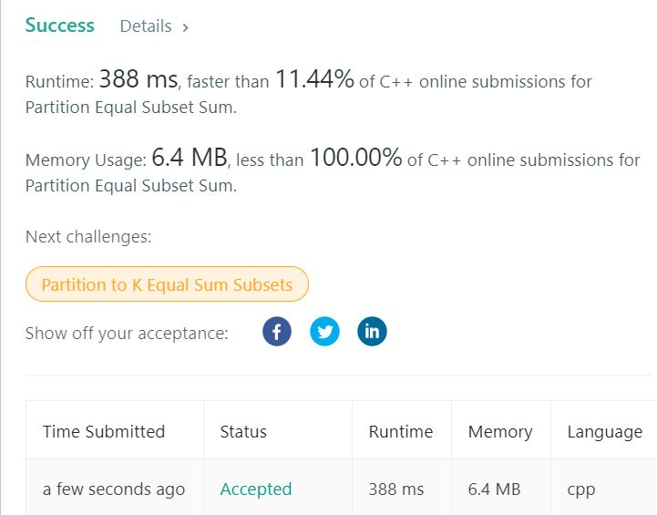

# 416. Partition Equal Subset Sum
Given a non-empty array containing only positive integers, find if the array can be partitioned into two subsets such that the sum of elements in both subsets is equal.  

**Note:**
Each of the array element will not exceed 100.  
The array size will not exceed 200.  

**Example1:**   
```
Input: [1, 5, 11, 5]

Output: true

Explanation: The array can be partitioned as [1, 5, 5] and [11].
```

## trial1
### Intuition
```
1.  먼저 모든 요소들의 합을 구해준다. 그리고 반으로 나눠져야지만 partitioned sum이 존재할 가능성이 있다.
2.  dp라는 boolean 표를 만들어서 sum이라는 index가 존재할 만큼의 vector의 크기로 지정해준다.
3.  모든 nums에 있는 숫자들을 돌면서 합이 될 수 있는 index에 대하여 dp vector을 true로 만들어준다.
4.  어떤 요소든 dp의 sum의 인덱스가 true가 되면 partion sum이 만들어진다는 의미로 true를 output으로 return 한다.

1. First, find the "sum" of all elements. Then the "sum" should be divided in half. if it is divided without remainder, there is a possibility that a partitioned sum exists.
2. Create a boolean table called "dp" with a size of the "sum+1" so that there is an index of "sum".
3. Make the "dp" vector true for the index that can be summed by rotating the numbers in all nums. 
4. If the index of "sum" of "dp" of any element becomes true, partion sum is created, and true is returned to the output.
```
### Codes  
```cpp
class Solution {
public:
	bool canPartition(vector<int>& nums) {
		int sum = 0;
		for (int i = 0; i < nums.size(); i++) {
			sum += nums[i];
		}
		if (sum % 2 != 0) return false;
		sum /= 2;
		vector<bool> dp(sum + 1, false);
		dp[0] = true;
		for (int n : nums) {
			for (int j = sum; j >= 0; j--) {
				if (j - n >= 0) {
					dp[j] = dp[j] || dp[j - n];
				}
			}
		}
		return dp[sum];
	}
};
```

### Results (Performance)  
**Runtime:**  388 ms         
**Memory Usage:** 6.4 MB

<p align="center"> 

</p>


### 문제 URL (LeetCode)  
https://leetcode.com/problems/partition-equal-subset-sum/