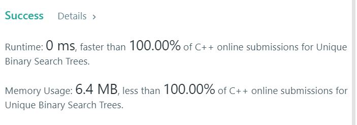

# 96.Unique Binary Search Trees
Given n, how many structurally unique BST's (binary search trees) that store values 1 ... n?  


## Example1

```
Input: 3
Output: 5
Explanation:
Given n = 3, there are a total of 5 unique BST's:

   1         3     3      2      1
    \       /     /      / \      \
     3     2     1      1   3      2
    /     /       \                 \
   2     1         2                 3
```

## trial1
### Intuition
```
dp로 문제를 해결하였다.
예시로 n이 3이라고 할때
root  1 2 3
left  0 1 2
right 2 1 0

각 숫자마다 왼쪽에 올 수 있는 node의 개수와 오른쪽에 올수 있는 node의 개수들이 위와 같이 된다.
그래서 left에 올 수 있는 node의 경우의 수와 right에 올 수 있는 경우의 수의 조합의 합이 n에 대한 모든 BST의 수이다.
left와 right의 경우의 수들은 이전에 dp에 저장해 두었던 값으로 구할 수 있다.
위의 예시에서는 root가 1일때는 dp[0]*dp[2], root가 2일때는 dp[1]*dp[1] 3일때는 dp[2]*dp[0]이 된다.
그래서 이것을 n만큼 반복해서 dp에서 n번째 값을 가져오게 되면 정답이 된다.
연산횟수를 줄이기 위해서 반복문에서 반을 나눠서 계산하였다.


I solved the problem with Dynamic Programming.
For example, when n is 3
root  1 2 3
left  0 1 2
right 2 1 0

For each number, the number of nodes that can come to the left and the number of nodes that can come to the right are as shown above.
So the sum of the combination of the number of nodes that can come to the left and right is the number of all BSTs for n.
The numbers for the left and right cases can be obtained from the values ​​previously stored in dp.
In the above example, when root is 1, dp [0] * dp [2], when root is 2, dp [1] * dp [1] when 3 is dp [2] * dp [0].
So if you repeat this n times, dp[n] will be the correct answer.
In order to reduce the number of calculations, I calculated by dividing half in the loop.
```
### Codes  
```cpp
class Solution {
public:
    int numTrees(int n) {
        vector<int> a;
        a.push_back(1);
        a.push_back(1);
        int half = 0;
        int tmp = 0;
        int i = 0;
        for(int cnt=2;cnt<=n;cnt++){
            tmp = 0;
            half = cnt / 2;
            for (i = 0; i < half; i++) {
                tmp += a[i] * a[(cnt - (i+1))];
            }
            tmp *= 2;
            if (cnt % 2 == 1) {//가운데꺼 한번더
                tmp += a[i] * a[i];
            }
            a.push_back(tmp);
        }
        return a[n];
    }
};
```

### Results (Performance)  
**Runtime:**  0 ms  
**Memory Usage:** 	6.4 MB  


<p align="center"> 

</p>


### 문제 URL (LeetCode)  
https://leetcode.com/problems/unique-binary-search-trees/