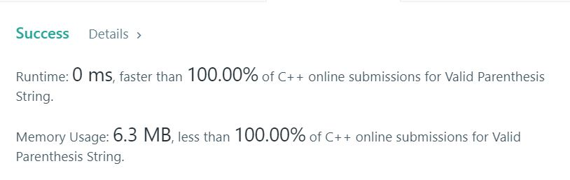

# 678. Valid Parenthesis String

Given a string containing only three types of characters: '(', ')' and '*', write a function to check whether this string is valid.  
We define the validity of a string by these rules  
Any left parenthesis '(' must have a corresponding right parenthesis ')'.  
Any right parenthesis ')' must have a corresponding left parenthesis '('.  
Left parenthesis '(' must go before the corresponding right parenthesis ')'.  
'*' could be treated as a single right parenthesis ')' or a single left parenthesis '(' or an empty string.  
An empty string is also valid.  

**Example1:**   
```
Input: "()"
Output: True
```

**Example2:**   
```
Input: "(*)"
Output: True
```

**Example3:**   
```
Input: "(*))"
Output: True
```

## trial1
### Intuition
```
stack의 성질을 이용하여 코드를 작성하였습니다. '('와 '*'가 나오면 각각 "lft(left)"와 "star" 벡터 push를 하고 ')'가 나오면 "lft"에서 가장 뒤에 있는 값을 pop을 해줍니다. 그렇게 하면 성립이 되는 최대의 괄호에 대해서는 제외를 시키고 '*'를 고려하지 않고 괄호가 성립이 되지 않는 값들에 대하여 계산하게 됩니다. 그 후에는 '*'를 생각하여 만약에 "("에 대하여 '*'가 인덱스가 뒤에있는 경우에만 성립이 되도록 if else문을 사용하여 구현하였습니다.


I wrote the code using the properties of the stack. If '(' and '*' appear, push "lft (left)" and "star" vector respectively, and if '"' appears, pop the last value in" lft ". Doing so excludes the largest parenthesis that comes true and does not consider the '*', and calculates the values ​​that the parentheses do not hold. After that, the '*' was considered and implemented using the if else statement so that "*" for "(" is only established when the index follows.
```
### Codes  
```cpp
class Solution {
public:
	bool checkValidString(string s) {
		vector<int> lft;
		vector<int> star;
		for (int i = 0; i < s.size(); i++) {
			if (s[i] == '(') {
				lft.push_back(i);
			}
			else if (s[i] == '*') {
				star.push_back(i);
			}
			else if(!lft.empty()){
				lft.pop_back();
			}
			else if(!star.empty()){
				star.pop_back();
			}
			else {
				return false;
			}
		}
		while (!lft.empty()) {
			if (star.empty() || star.back() < lft.back()) {
				return false;
			}
			else {
				star.pop_back();
				lft.pop_back();
			}
		}
		return true;
	}
};
```

### Results (Performance)  
**Runtime:**  0 ms  O(n)
**Memory Usage:** 	6.3 left의 개수와 star 개수만큼의 메모리를 추가로 사용 O(n-left-star)

<p align="center"> 

</p>

### Discussion
```
class Solution {
public:
    bool checkValidString(string s) {
        int low = 0; int high = 0;
        for(char c : s)
        {
            low += c == '(' ? 1 : -1;
            high += c != ')' ? 1 : -1;
            
            if(high < 0) break;

            low = max(low, 0);
        }

        return low == 0;
    }
};
```

### 문제 URL (LeetCode)  
https://leetcode.com/problems/valid-parenthesis-string/