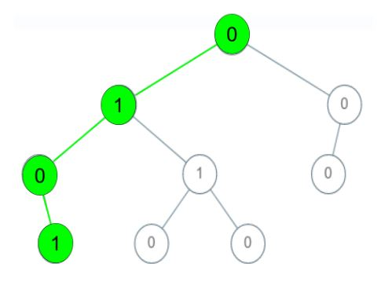
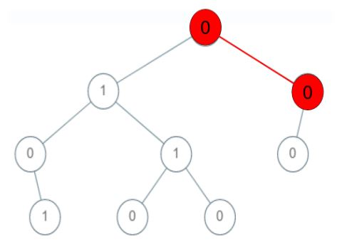
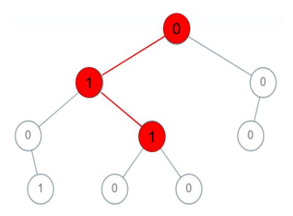
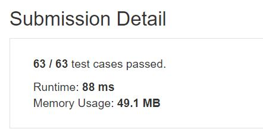

# Check If a String Is a Valid Sequence from Root to Leaves Path in a Binary Tree

Given a binary tree where each path going from the root to any leaf form a valid sequence, check if a given string is a valid sequence in such binary tree. 

We get the given string from the concatenation of an array of integers arr and the concatenation of all values of the nodes along a path results in a sequence in the given binary tree.


## Example1

<p align="center"> 

</p>

```
Input: root = [0,1,0,0,1,0,null,null,1,0,0], arr = [0,1,0,1]
Output: true
Explanation: 
The path 0 -> 1 -> 0 -> 1 is a valid sequence (green color in the figure). 
Other valid sequences are: 
0 -> 1 -> 1 -> 0 
0 -> 0 -> 0
```

## Example2

<p align="center"> 

</p>

```
Input: root = [0,1,0,0,1,0,null,null,1,0,0], arr = [0,0,1]
Output: false 
Explanation: The path 0 -> 0 -> 1 does not exist, therefore it is not even a sequence.
```

## Example3

<p align="center"> 

</p>

```
Input: root = [0,1,0,0,1,0,null,null,1,0,0], arr = [0,1,1]
Output: false
Explanation: The path 0 -> 1 -> 1 is a sequence, but it is not a valid sequence.
```

## trial1
### Intuition
```
처음에는 stack을 이용해서 값을 구해보려고 했다.
모든 값을 vector에 넣어놓고 밑에 있는 Node들부터 올라가면서 arr의 index값을 현재 node에 저장하는 방법이였다. 
하지만 이 방법은 제약상황이 많았고 연속적인 숫자들이 나오거나 root까지 가지 않더라도 arr을 만족하게 되었을때 값이 제대로 나오지 않아서 실패하였다.


At first, I tried to get the value using the stack.
It was a way to put all the values ​​into a vector and store the index value of arr in the current node ascending from the lower nodes. However, this method had many constraints and failed because the value did not appear properly when arr was satisfied even if consecutive numbers did not appear or go to the root.
```
### Codes  
```cpp
  class Solution {
  public:
	  bool isValidSequence(TreeNode* root, vector<int>& arr) {
		  vector<TreeNode*> v;
		  TreeNode * lr;
		  v.push_back(root);
		  int tmp = 0,idx=0;
		  for (int i = 0; i < v.size(); i++) {
			  if (v[i]->left != NULL) v.push_back(v[i]->left);
			  if (v[i]->right != NULL) v.push_back(v[i]->right);
		  }
		  for (int i = v.size() - 1; i >= 0; i--) {
			  if (v[i]->left == NULL && v[i]->right == NULL) {//가장 밑에 있는 Node
				  if (v[i]->val == arr[arr.size() - 1]) v[i]->val = arr.size() - 1;//만족하면 그 숫자
				  else v[i]->val = -1;//아니면 -1
			  }
			  else if (v[i]->left == NULL) {
				  if (v[i]->right->val > 0)//0은 parent만 가능 child이면 무조건 안됨
				  {
					  idx = v[i]->right->val - 1;//다음 인덱스
					  if (arr[idx] == v[i]->val) {
						  v[i]->val = idx;
					  }
					  else v[i]->val = -1;
				  }
				  else {
					  v[i]->val = -1;
				  }
			  }
			  else if (v[i]->right == NULL) {
				  if (v[i]->left->val > 0)//0은 parent만 가능 child이면 무조건 안됨
				  {
					  idx = v[i]->left->val - 1;//다음 인덱스
					  if (arr[idx] == v[i]->val) {
						  v[i]->val = idx;
					  }
					  else v[i]->val = -1;
				  }
				  else {
					  v[i]->val = -1;
				  }
			  }
			  else {
				  //lr = (v[i]->right->val > v[i]->left->val ? v[i]->right : v[i]->left);
				  if (v[i]->right->val > 0) {
					  idx = v[i]->right->val - 1;//다음 인덱스
					  if (arr[idx] == v[i]->val) {//현재값이 맞다면
						  tmp = idx;
					  }
					  else {
						  tmp = -1;
					  }
				  }
				  if(v[i]->left->val > 0){//left에 대해서도 해주기
					  idx = v[i]->right->val - 1;//다음 인덱스
					  if (arr[idx] == v[i]->val) {
						  tmp = idx;
					  }
				  }
				  v[i]->val = tmp;
			  }
		  }
		  return (root->val==0?true:false);
	  }
  };
```

## trial2
### Intuition
```
아래방법은 recursion으로 구현한 방법이다. 위의 방법보다 훨신 쉽게 구현할수 있엇다.
만약에 가장 밑에 있는 Node이게 된다면 값을 만족하고 idx가 마지막 요소를 가르키는 값과 같을때 true를 반환하는 방식이다. 
그 후에는 각 child node들에 대하여 함수를 실행하였다. 
res라는 boolean 값에 결과를 저장해놓고 이미 true인 상태라면 arr이 이미 Tree에 존재하는 것이므로 find를 더이상 할 필요 없이 true로 return을 해주었다.

The following method is implemented by recursion. It was much easier to implement than the above method.
If it is the lowest node, it is a method that satisfies the value and returns true when idx is equal to the value pointing to the last element.
After that, the function was executed for each child node.
If the result is stored in the boolean value called res and it is already true, arr already exists in the tree, so it returns to true without needing to find any more.
```
### Codes  
```cpp
  class Solution {
  public:
	  bool isValidSequence(TreeNode* root, vector<int>& arr) {
		  return find(root, arr, 0);
	  }
	  bool find(TreeNode* cur, vector<int>& arr,int idx) {
		  bool res=false;
		  if (idx < arr.size()) {
			  if (cur->val == arr[idx]) {
				  if (cur->left == NULL && cur->right == NULL) { 
					  return (idx == arr.size() - 1 ? true : false);
				  };
				  if (cur->left != NULL) { res = find(cur->left, arr, ++idx);
				  idx--;
				  }
				  if (cur->right != NULL) {
					  idx++;
					  res = (res ? true : find(cur->right, arr, idx));
				  idx--;
				  }
				  return res;
			  }
			  else {
				  return false;
			  }
		  }
		  else {
			  return false;
		  }
		  
	  }
  };
```

### Results (Performance)  
**Runtime:**   88 ms
**Memory Usage:** 	49.1 MB


<p align="center"> 

</p>


### 문제 URL (LeetCode)  
https://leetcode.com/explore/challenge/card/30-day-leetcoding-challenge/532/week-5/3315/