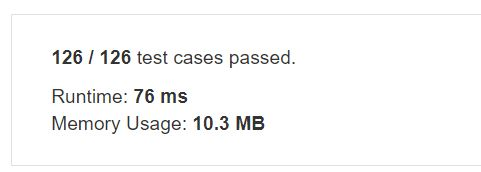
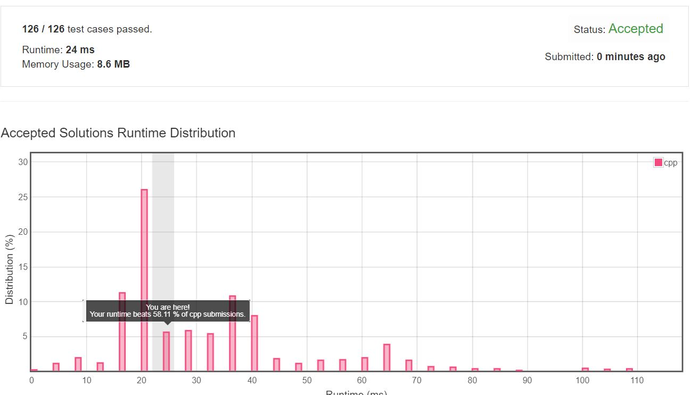

# 383. Ransom Note
Given an arbitrary ransom note string and another string containing letters from all the magazines, write a function that will return true if the ransom note can be constructed from the magazines ; otherwise, it will return false.  
  
Each letter in the magazine string can only be used once in your ransom note.  

Note:  
You may assume that both strings contain only lowercase letters.   


## Example1

```
canConstruct("a", "b") -> false
canConstruct("aa", "ab") -> false
canConstruct("aa", "aab") -> true
```

## trial1
### Intuition
```
unordered_map을 사용하여 각 letters들에 대해서 r에 존재한 letters들은 1씩 증가시켜주고 mag에 대해서는 --를 진행합니다.
만약에 이 map 안에 값들이 0보다 큰값이 있으면 r값이 mag에 들어있지 않다는 뜻입니다.


Using unordered_map, for each letters, the letters in r are incremented by 1, and for mag, proceed with-.
If the values ​​in this map are greater than 0, it means that the value of r is not in mag.
```
### Codes  
```cpp
class Solution {
public:
    bool canConstruct(string r, string mag) {
        unordered_map<char, int> m;
        for (int i = 0; i < r.size(); i++) {
            m[r[i]]++;
        }
        for (int i = 0; i < mag.size(); i++) {
            if (m.find(mag[i]) != m.end()) {
                m[mag[i]]--;
            }
        }
        for (int i = 0; i < m.size(); i++) {
            if (m[i] > 0) return false;
        }
        return true;
    }
};
```

### Results (Performance)  
**Runtime:**  76 ms  
**Memory Usage:** 	10.3 MB  


<p align="center"> 

</p>

## trial2
### Intuition
```
arr을 사용하여 각 letters들에 대해서 r에 존재한 letters들은 1씩 증가시켜주고 mag에 대해서는 --를 진행합니다.
만약에 이 arr 안에 값들이 0보다 큰값이 있으면 r값이 mag에 들어있지 않다는 뜻입니다.


For each letters, the letters in r are incremented by 1 using arr, and-is performed for mag.
If the values ​​in this arr are greater than 0, it means that the value of r is not in mag.
```
### Codes  
```cpp
class Solution {
public:
    bool canConstruct(string r, string mag) {
        int arr[26] = { 0, };
        for (int i = 0; i < r.size(); i++) {
            arr[r[i]-97]++;
        }
        for (int i = 0; i < mag.size(); i++) {
            arr[mag[i] - 97]--;
        }
        for (int i = 0; i < 26; i++) {
            if (arr[i] > 0) return false;
        }
        
        return true;
    }
};
```

### Results (Performance)  
**Runtime:**  24 ms  
**Memory Usage:**   8.6 MB  
<p align="center"> 

</p>

### 문제 URL (LeetCode)  
https://leetcode.com/problems/ransom-note/