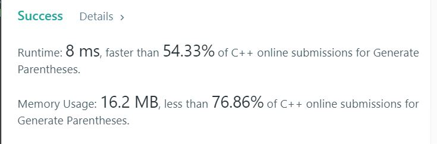

# 22. Generate Parentheses
Given n pairs of parentheses, write a function to generate all combinations of well-formed parentheses.  


## Example1

```
For example, given n = 3, a solution set is:

[
  "((()))",
  "(()())",
  "(())()",
  "()(())",
  "()()()"
]
```

## trial1
### Intuition
```
dfs 방식으로 n개의 left와 right 괄호로 만들수 있는 모든 조합에 대해서 조사한다.
left 괄호를 lt라고 하고 right 괄호를 rt라고 한다. 
lt와 rt는 처음에 함수 매개변수로 들어갈때 n으로 들어가고 각 괄호 방향을 사용하면 -1이 되는 방식이다.
만약에 lt가 rt보다 크다면 그것은 괄호의 특성에 맞지 않다는 뜻이다.
만약에 lt와 rt 둘다 0이라는 것은 모든 괄호를 사용했다는 뜻이므로 하나의 조합이 완성된다.
lt가 우선순위이므로 lt에 대해서 먼저 처리를 해주고 그다음에 rt에 대해서 매개변수 호출과 함께 string도 추가해준다.

Examine all combinations that can be made of left and right parentheses using the dfs method.
The left parenthesis is called lt and the right parenthesis is called rt.
lt and rt go into n when you first enter a function parameter and -1 if you use the angle bracket direction.
If lt is greater than rt, it means that it does not fit the properties of parentheses.
If both lt and rt are 0, this means that all parentheses are used, so a combination is completed.
Since lt is a priority, lt is processed first, and then string is added along with parameter calls to rt.
```
### Codes  
```cpp
class Solution {
public:
    vector<string> generateParenthesis(int n) {
        vector<string> res;
        dfs(res, "", n, n);
        return res;
    }
    void dfs(vector<string>& res,string cur, int lt, int rt) {
        if (lt > rt) return;
        if (lt == 0 && rt == 0) {
            res.push_back(cur);
            return;
        }
        if (lt > 0) {
            cur += "(";
            dfs(res, cur, lt - 1, rt);
            cur.pop_back();
        }
        if (rt > 0) {
            cur += ")";
            dfs(res, cur, lt, rt - 1);
            cur.pop_back();
        }
    }
};
```

### Results (Performance)  
**Runtime:**  8 ms  
**Memory Usage:** 	16.2 MB  


<p align="center"> 

</p>


### 문제 URL (LeetCode)  
https://leetcode.com/problems/generate-parentheses/