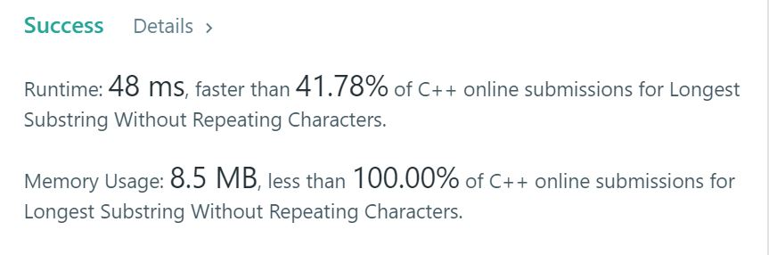

# 3. Longest Substring Without Repeating Characters
Given a string, find the length of the longest substring without repeating characters.  

## Example1

```
Input: "abcabcbb"
Output: 3 
Explanation: The answer is "abc", with the length of 3. 
```

## Example2

```
Input: "bbbbb"
Output: 1
Explanation: The answer is "b", with the length of 1.
```

## Example3

```
Input: "pwwkew"
Output: 3
Explanation: The answer is "wke", with the length of 3. 
             Note that the answer must be a substring, "pwke" is a subsequence and not a substring.
```

## trial1
### Intuition
```
맵을 사용하여 char의 사용한 개수를 저장한다. 만약에 i번째 값이 이미 존재한다면 i번째값에 대하여 앞에 존재하지 않을때
까지 start 인덱스를 1씩 증가시켜준다. 만약 i번째 값이 이미 존재하는 것이 아니라 그저 현재 i번째 값의 대한 개수를
1 증가시킨다.


Use map to store the number of chars used. If the i-th value already exists, it does not exist before the i-th value
Until start index is increased by one. If the i-th value does not already exist, just the number of the current i-th value
Increase by 1.
```
### Codes  
```cpp
class Solution {
public:
    Solution() {
        ios::sync_with_stdio(false);
        cin.tie(nullptr);
        cout.tie(nullptr);
    }
    int lengthOfLongestSubstring(string s) {
        map<char,int> let;
        int local=1;
        int st = 0;
        if (s.size() == 0) return 0;
        let[s[0]]++;
        for (int i = 1; i < s.size(); i++) {
            if (let[s[i]]>0) {
                while (st < i) {
                    let[s[st]]--;
                    st++;
                    if (let[s[i]]==0) {
                        break;
                    }
                }
                let[s[i]]++;
            }
            else {
                let[s[i]]++;
            }
            if ((i - st + 1) > local) local = i - st + 1;
        }
        return local;
    }
};
```

### Results (Performance)  
**Runtime:**  48 ms O(n)  
**Memory Usage:** 	8.5 MB  

<p align="center"> 

</p>


### 문제 URL (LeetCode)  
https://leetcode.com/problems/longest-substring-without-repeating-characters/