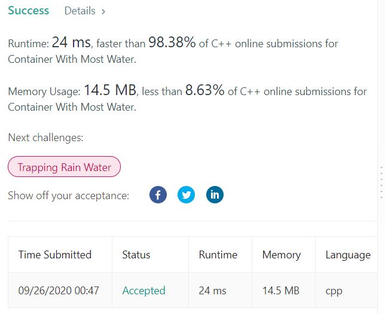

# 11. Container With Most Water
Given n non-negative integers a1, a2, ..., an , where each represents a point at coordinate (i, ai). n vertical lines are drawn such that the two endpoints of line i is at (i, ai) and (i, 0). Find two lines, which together with x-axis forms a container, such that the container contains the most water.  

Note: You may not slant the container and n is at least 2.  

The above vertical lines are represented by array [1,8,6,2,5,4,8,3,7]. In this case, the max area of water (blue section) the container can contain is 49.

## Example1

```
Input: [1,8,6,2,5,4,8,3,7]
Output: 49
```


## trial1
### Intuition
```
두개의 포인터를 두고 왼쪽과 오른쪽 기준으로 점점 포인터의 거리를 줄여가면서 최대 넓이를 구해주는 방식이다.  

```
### Codes  
```cpp
int maxArea(vector<int>& height) {
    int lft = 0, rt = height.size() - 1;
    int mx = 0;
    while (lft < rt) {
        int h = (height[lft] < height[rt] ? height[lft] : height[rt]);
        int nw = h * (rt - lft);
        (height[lft] > height[rt] ? rt-- : lft++);
        mx = max(mx, nw);
    }
    return mx;
}
```


### Results (Performance)  
**Runtime:**  25 ms 
**Memory Usage:** 	14.5 MB  

<p align="center"> 

</p>


### 문제 URL (LeetCode)  
https://leetcode.com/problems/container-with-most-water/