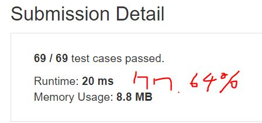

# 221. Maximal Square

Given a 2D binary matrix filled with 0's and 1's, find the largest square containing only 1's and return its area.   


***Example1***
```
Input: 

1 0 1 0 0
1 0 1 1 1
1 1 1 1 1
1 0 0 1 0

Output: 4
```


## trial1
### Intuition
```
dp 문제로 현재 인덱스 기준으로 위 왼쪽 대각선 왼쪽 위가 만족하는 최소의 넓이에 +1을 하여 현재 인덱스의 넓이 값으로 채워준다. 그러는 과정중에 size의 최대값을 계속 저장해준다. 마지막으로 사이즈의 제곱이 넓이 값이 되는 것을 알 수 있다.


Due to the dp problem, 1 is added to the minimum area that the upper left diagonal, upper and left are satisfied based on the current index, and the current index is filled with the value. During this process, the maximum value of size is continuously stored. Finally, we can see that the square of the size is the area value.
```
### Codes  
```cpp
class Solution {
public:
	int maximalSquare(vector<vector<char>>& m) {
		if (m.size() == 0) return 0;
		int size = 0;
		//int a[][] = { 0, };
		vector<vector<int>> a(m.size()+1, vector<int>(m[0].size()+1, 0));
		for (int i = 1; i < a.size(); i++) {
			for (int j = 1; j < a[i].size(); j++) {
				a[i][j] = m[i - 1][j - 1] - '0';
			}
		}
		for (int i = 1; i < a.size(); i++) {
			for (int j = 1; j < a[i].size(); j++) {
				if(a[i][j]==1) {
					a[i][j] = min(a[i - 1][j], min(a[i - 1][j-1], a[i][j-1]))+1;
					if (a[i][j] > size) size = a[i][j];
				}
			}
		}
		return size*size;
	}
};
```
### Results (Performance)  
**Runtime:**  20 ms 
**Memory Usage:** 	8.8 MB


<p align="center"> 

</p>


### Discussion


### 문제 URL (LeetCode)  
https://leetcode.com/problems/maximal-square/