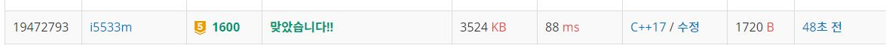

# 말이 되고픈 원숭이 

동물원에서 막 탈출한 원숭이 한 마리가 세상구경을 하고 있다. 그 녀석은 말(Horse)이 되기를 간절히 원했다. 그래서 그는 말의 움직임을 유심히 살펴보고 그대로 따라 하기로 하였다. 말은 말이다. 말은 격자판에서 체스의 나이트와 같은 이동방식을 가진다. 다음 그림에 말의 이동방법이 나타나있다. x표시한 곳으로 말이 갈 수 있다는 뜻이다. 참고로 말은 장애물을 뛰어넘을 수 있다.    

근데 원숭이는 한 가지 착각하고 있는 것이 있다. 말은 저렇게 움직일 수 있지만 원숭이는 능력이 부족해서 총 K번만 위와 같이 움직일 수 있고, 그 외에는 그냥 인접한 칸으로만 움직일 수 있다. 대각선 방향은 인접한 칸에 포함되지 않는다.    

이제 원숭이는 머나먼 여행길을 떠난다. 격자판의 맨 왼쪽 위에서 시작해서 맨 오른쪽 아래까지 가야한다. 인접한 네 방향으로 한 번 움직이는 것, 말의 움직임으로 한 번 움직이는 것, 모두 한 번의 동작으로 친다.   격자판이 주어졌을 때, 원숭이가 최소한의 동작으로 시작지점에서 도착지점까지 갈 수 있는 방법을 알아내는 프로그램을 작성하시오.    

**입력**  
첫째 줄에 정수 K가 주어진다. 둘째 줄에 격자판의 가로길이 W, 세로길이 H가 주어진다. 그 다음 H줄에 걸쳐 W개의 숫자가 주어지는데, 0은 아무것도 없는 평지, 1은 장애물을 뜻한다. 장애물이 있는 곳으로는 이동할 수 없다. 시작점과 도착점은 항상 평지이다. W와 H는 1이상 200이하의 자연수이고, K는 0이상 30이하의 정수이다.    

**출력**  
첫째 줄에 원숭이의 동작수의 최솟값을 출력한다. 시작점에서 도착점까지 갈 수 없는 경우엔 -1을 출력한다.  

**Example1:**   
```
1
4 4
0 0 0 0
1 0 0 0
0 0 1 0
0 1 0 0

4
```

## trial1
### Intuition
```
BFS를 이용하여 모든 방향에 대해 탐색을 해야한다.
hx와 hy는 말의 걸음걸이 대한 다음 거리를 담은 배열이다
xx와 yy는 그냥 원숭이의 걸음걸이에 대한 배열이다.
queue에 넣는 요소들로는 걸음걸이 횟수와 k의 수 그리고 x축과 y축이다.
visit는 k에 대한 visit도 필요하므로 3차원으로 선언을 한다. 그 이유는 k의 횟수에 대하여 어디를 방문할 수 있는지에 대한 정보를 담고 있어야 같은 좌표에 도착하더라도 k를 이용하여 도착한 좌표인지 아닌지를 확인 할 수 있기 때문이다.  

q에는 처음에 0,0 좌표를 넣고 큐가 비어서 갈수 있는 좌표가 더이상 없을때까지 진행을 한다.
말처럼 걸을수 있는 횟수가 1이상인 경우에만 말처럼 걷는 거리에 대한 좌표값을 큐에 넣어준다.
현재 좌표에서 1씩 갈수 있는 좌표에 대하여도 큐에 넣어준다. 이렇게 계속 진행하다보면 가장 먼저 h-1,w-1 좌표에 도착하는 경우가 최단 거리가 된다.
```

### Codes  
```cpp
int arr[201][201] = { 0, };
int mina[201][201] = { 0, };
bool visit[201][201][31] = { 0, };
int k, w, h,stest=-1;
queue<pair<pair<int, int>, pair<int, int>>> q;//1-1: 남은 k수, 1-2: 현재 걸음수, 2-1:x 2-2:y
int xx[4] = { 0,1,-1,0 }, yy[4] = { 1,0,0,-1 };
//int hx[8] = { 1,2,1,2,-1,-2,-1,-2 }, hy[8] = { -2,-1,2,1,2,1,-2,-1 };
int hx[8] = { 1,1,2,2,-2,-2 ,-1,-1  }, hy[8] = { -2,2,-1,1,-1,1,-2,2 };
int visitall() {
	pair<pair<int,int>, pair<int, int>> cur;
	int x, y,kk,walk,nx,ny;
	while (!q.empty()) {
		cur = q.front();
		kk = cur.first.first;
		walk = cur.first.second;
		x = cur.second.first;
		y = cur.second.second;
		q.pop();
		if (x == w-1 && y == h-1) {//가장 먼저 들어온애가 최단거리..?
			stest = walk;
			break;
		}
		
		if (kk >= 1) {
			for (int i = 0; i < 8; i++) {
				nx = x + hx[i];
				ny = y + hy[i];
				if (nx >= 0 && ny >= 0 && nx < w && ny < h) {
					if (arr[ny][nx] != 1 && !visit[ny][nx][kk - 1]) {
						q.push(make_pair(make_pair(kk - 1, walk + 1), make_pair(nx, ny)));
						visit[ny][nx][kk - 1] = true;
					}
				}
			}
		}
		for (int i = 0; i < 4; i++) {
			nx = x + xx[i];
			ny = y + yy[i];
			if (nx >= 0 && ny >= 0 && nx < w && ny < h) {
				if (arr[ny][nx] != 1 && !visit[ny][nx][kk]) {
					q.push(make_pair(make_pair(kk, walk + 1), make_pair(nx, ny)));
					visit[ny][nx][kk] = true;
				}
			}
		}
	}
	return stest;
}
```

### Results (Performance)  
**Runtime:**  88 ms O(n^2)  
**Memory Usage:** 	3524 MB     


<p align="center"> 

</p>


### 문제 URL (백준)  
https://www.acmicpc.net/problem/1600