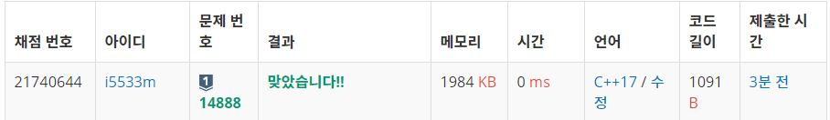

# 공유기 설치
N개의 수로 이루어진 수열 A1, A2, ..., AN이 주어진다. 또, 수와 수 사이에 끼워넣을 수 있는 N-1개의 연산자가 주어진다. 연산자는 덧셈(+), 뺄셈(-), 곱셈(×), 나눗셈(÷)으로만 이루어져 있다.

우리는 수와 수 사이에 연산자를 하나씩 넣어서, 수식을 하나 만들 수 있다. 이때, 주어진 수의 순서를 바꾸면 안 된다.

예를 들어, 6개의 수로 이루어진 수열이 1, 2, 3, 4, 5, 6이고, 주어진 연산자가 덧셈(+) 2개, 뺄셈(-) 1개, 곱셈(×) 1개, 나눗셈(÷) 1개인 경우에는 총 60가지의 식을 만들 수 있다. 예를 들어, 아래와 같은 식을 만들 수 있다.

1+2+3-4×5÷6
1÷2+3+4-5×6
1+2÷3×4-5+6
1÷2×3-4+5+6
식의 계산은 연산자 우선 순위를 무시하고 앞에서부터 진행해야 한다. 또, 나눗셈은 정수 나눗셈으로 몫만 취한다. 음수를 양수로 나눌 때는 C++14의 기준을 따른다. 즉, 양수로 바꾼 뒤 몫을 취하고, 그 몫을 음수로 바꾼 것과 같다. 이에 따라서, 위의 식 4개의 결과를 계산해보면 아래와 같다.

1+2+3-4×5÷6 = 1
1÷2+3+4-5×6 = 12
1+2÷3×4-5+6 = 5
1÷2×3-4+5+6 = 7
N개의 수와 N-1개의 연산자가 주어졌을 때, 만들 수 있는 식의 결과가 최대인 것과 최소인 것을 구하는 프로그램을 작성하시오.

## Example1

```
Input: 
2
5 6
0 0 1 0

Output: 
30
30
```
## Example2

```
Input: 
3
3 4 5
1 0 1 0

Output: 
35
17
```


## trial1
### Intuition
```
DFS 방식으로 문제를 해결하였고 숫자 사이에 연산자가 들어가는 부분에서 4가지의 경우의 수(연산자)를 생각한다.
만약에 연산자의 개수가 숫자의 개수보다 1개 작은경우 모든 연산자가 선택이 된 경우이므로 결과값을 구해서
minimum 값인지 maximum 값인지 확인해준다.
```
### Codes  
```cpp
void function(vector<int> &all) {
    if (num.size() == (all.size() + 1)) {//operation의 경우의수
        int res = num[0];
        for (int i = 1; i < num.size(); i++) {
            switch (all[i - 1]) {
            case 0:
                res += num[i];
                break;
            case 1:
                res -= num[i];
                break;
            case 2:
                res *= num[i];
                break;
            case 3:
                res /= num[i];
                break;
            }
        }
        mn = min(mn, res);
        mx = max(mx, res);
    }
    else {
        for (int i = 0; i < 4; i++) {
            if (op[i] > 0) {
                op[i]--;
                all.push_back(i);
                function(all);
                all.pop_back();
                op[i]++;
            }
        }
    }
}
```

### Results (Performance)  
**Runtime:**  0 ms 
**Memory Usage:** 	1984 kb 

<p align="center"> 

</p>


### 문제 URL (백준)  
https://www.acmicpc.net/problem/14888