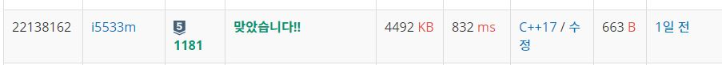

# 단어 정렬

알파벳 소문자로 이루어진 N개의 단어가 들어오면 아래와 같은 조건에 따라 정렬하는 프로그램을 작성하시오.

길이가 짧은 것부터
길이가 같으면 사전 순으로
입력
첫째 줄에 단어의 개수 N이 주어진다. (1≤N≤20,000) 둘째 줄부터 N개의 줄에 걸쳐 알파벳 소문자로 이루어진 단어가 한 줄에 하나씩 주어진다. 주어지는 문자열의 길이는 50을 넘지 않는다.

출력
조건에 따라 정렬하여 단어들을 출력한다. 단, 같은 단어가 여러 번 입력된 경우에는 한 번씩만 출력한다.


## Example1

```
Input: 
13
but
i
wont
hesitate
no
more
no
more
it
cannot
wait
im
yours

Output: 
i
im
it
no
but
more
wait
wont
yours
cannot
hesitate
```

## Example2

```
Input: 
1 4

Output: 
2
2
```

## trial1
### Intuition
```
compare 함수를 사용하는 방법에 대해서 공부하였다.
compare을 사용해서 먼저 정렬을 하고 중복을 없애주기 위해서 출력하는 과정에서 중복되는 것을 출력하지 못하도록 하였다.
```
### Codes  
```cpp
bool compare(const string a, const string b) {
    if (a.size() != b.size()) {//문자열 개수 다르면 작은거 우선
        return a.size() < b.size();
    }
    else {
        return a < b;
    }
}
int main() {
    int N;
    vector<string> s;
    freopen("단어정렬.txt", "r", stdin);
    cin >> N;
    for (int i = 0; i < N; i++) {
        string tmp;
        cin >> tmp;
        s.push_back(tmp);
    }
    sort(s.begin(), s.end(),compare);
    string prev = "";
    for (int i = 0; i < s.size(); i++) {
        if (s[i] != prev) {
            cout << s[i] << endl;
            prev = s[i];
        }
    }
    return 0;
}
```
### Results (Performance)  
**Runtime:** 832 ms   
**Memory Usage:**       4492 kb    

<p align="center"> 

</p>


### 문제 URL (백준)  
https://www.acmicpc.net/problem/1181