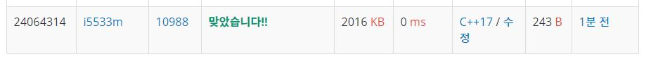

# 팰린드롬인지 확인하기

문제  
알파벳 소문자로만 이루어진 단어가 주어진다. 이때, 이 단어가 팰린드롬인지 아닌지 확인하는 프로그램을 작성하시오.

팰린드롬이란 앞으로 읽을 때와 거꾸로 읽을 때 똑같은 단어를 말한다.   

level, noon은 팰린드롬이고, baekjoon, online, judge는 팰린드롬이 아니다.  

입력  
첫째 줄에 단어가 주어진다. 단어의 길이는 1보다 크거나 같고, 100보다 작거나 같으며, 알파벳 소문자로만 이루어져 있다.  

출력  
첫째 줄에 팰린드롬이면 1, 아니면 0을 출력한다.  


## Example1

```
Input: 
level

Output: 
1
```

## Example2

```
Input: 
baekjoon

Output: 
0
```

## trial1
### Intuition
```
앞과 뒤가 같은지 확인 하면 끝~
n/2만큼의 시간이 걸린다.
```
### Codes  
```cpp
int main() {
    string s;
    cin >> s;
    for (int i = 0; i < s.size()/2; i++) {
        if (s[i] != s[s.size() - i-1]) {
            cout << 0 << endl;
            return 0;
        }
    }
    cout << 1 << endl;
    return 0;
}
```

### Results (Performance)  
**Runtime:** 0 ms   
**Memory Usage:**   2016 kb    

<p align="center"> 

</p>


### 문제 URL (백준)  
https://www.acmicpc.net/problem/10988