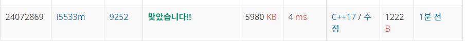

# LCS 2

문제
LCS(Longest Common Subsequence, 최장 공통 부분 수열)문제는 두 수열이 주어졌을 때, 모두의 부분 수열이 되는 수열 중 가장 긴 것을 찾는 문제이다.

예를 들어, ACAYKP와 CAPCAK의 LCS는 ACAK가 된다.

입력
첫째 줄과 둘째 줄에 두 문자열이 주어진다. 문자열은 알파벳 대문자로만 이루어져 있으며, 최대 1000글자로 이루어져 있다.

출력
첫째 줄에 입력으로 주어진 두 문자열의 LCS의 길이를, 둘째 줄에 LCS를 출력한다.

LCS가 여러 가지인 경우에는 아무거나 출력하고, LCS의 길이가 0인 경우에는 둘째 줄을 출력하지 않는다.


## Example1

```
Input: 
ACAYKP
CAPCAK

Output: 
4
ACAK
```

## trial1
### Intuition
```
앞에 공백이 있다고 생각하고 각 문자열에 대해 " "를 더해준다.
문자열을 각각 a와 b라고 둔다.
LCS의 길이를 구한다고 생각하고 숫자를 초기화할 a+1 by b+1의 길이만큼 모두 0으로 초기화하고 arr로 선언한다.
현재 a의 i번째 알파벳과 b의 j번째 알파벳이 같은지 확인하고 같으면 arr의 i-1과 j-1번재 값에 1만큼 더해준다.
만약에 다르다면 arr의 i-1,j 에 있는 값과 i,j-1에 있는 값중 어떤 것이 더 큰지 확인하고 arr의 i,j번째에 값을
넣어준다. 이 작업을 모두 해주면 마지막 항에는 최대 LCS 길이값이 저장되고
그 문자열을 찾기 위해서는 LCS의 길이가 변화하는 인덱스의 알파벳을 저장하면 된다.
```
### Codes  
```cpp
int main() {
    freopen("LCS2.txt", "r", stdin);
    string a, b;
    cin >> a;
    cin >> b;
    a = " " + a;
    b = " " + b;
    vector<vector<int>> arr(a.size(), vector<int>(b.size(), 0));

    for (int i = 1; i < a.size(); i++) {
        for (int j = 1; j < b.size(); j++) {
            if (a[i] == b[j]) {//현재 i번째와 j번째가 같으면 대각선에서 더한다.
                arr[i][j] = arr[i - 1][j - 1]+1;
            }
            else {
                arr[i][j] = max(arr[i - 1][j], arr[i][j - 1]);
            }
        }
    }
    cout << arr[a.size()-1][b.size()-1]<<endl;
    if (arr[a.size() - 1][b.size() - 1] > 0) {
        int i, j;
        string ans;
        for (i = a.size() - 1, j = b.size() - 1; i > 0 && j > 0;) {
            if (arr[i][j] == arr[i - 1][j]) {
                i--;
            }
            else if (arr[i][j] == arr[i][j - 1]) {
                j--;
            }
            else {
                ans.push_back(a[i]);
                i--;
                j--;
            }
        }
        for (int z = ans.size() - 1; z >= 0; z--) {
            cout << ans[z];
        }cout << endl;
    }
    return 0;
}
```

### Results (Performance)  
**Runtime:** 4 ms   
**Memory Usage:**   5980 kb    

<p align="center"> 

</p>


### 문제 URL (백준)  
https://www.acmicpc.net/problem/9252