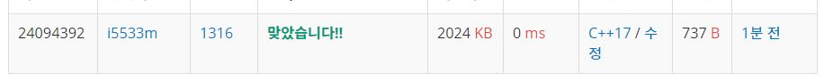

# 그룹 단어 체커  

문제  
그룹 단어란 단어에 존재하는 모든 문자에 대해서, 각 문자가 연속해서 나타나는 경우만을 말한다. 예를 들면,   ccazzzzbb는 c, a, z, b가 모두 연속해서 나타나고, kin도 k, i, n이 연속해서 나타나기 때문에 그룹 단어이지만,   aabbbccb는 b가 떨어져서 나타나기 때문에 그룹 단어가 아니다.  

단어 N개를 입력으로 받아 그룹 단어의 개수를 출력하는 프로그램을 작성하시오.  

입력  
첫째 줄에 단어의 개수 N이 들어온다. N은 100보다 작거나 같은 자연수이다. 둘째 줄부터 N개의 줄에 단어가 들어온다.  
단어는 알파벳 소문자로만 되어있고 중복되지 않으며, 길이는 최대 100이다.  

출력
첫째 줄에 그룹 단어의 개수를 출력한다.

## Example1

```
Input: 
3
happy
new
year

Output: 
3
```
## Example2

```
Input: 
4
aba
abab
abcabc
a

Output: 
1
```

## trial1
### Intuition
```
map을 사용해서 문제를 해결했다.
만약에 이미 알파벳이 나왔다면 이전에도 이미 나왔다는 뜻이므로 바로 직전의 인덱스가 같은 알파벳이 아니면
그것은 그룹알파벳을 만족하지 않는다는 뜻이다.
그래서 그룹알파벳을 만족하는 경우에만 cnt를 올려주면 끝이다.
```
### Codes  
```cpp
int main() {
    //freopen("그룹단어체크.txt", "r", stdin);
    int n;
    cin >> n;
    vector<string> v;
    for (int i = 0; i < n; i++) {
        string s;
        cin >> s;
        v.push_back(s);
    }
    int cnt = 0;
    for (int i = 0; i < v.size(); i++) {
        map<int, bool> m;
        char cur = v[i][0];
        bool yes = true;
        for (int j = 0; j < v[i].size(); j++) {
            if (m.find(v[i][j]) != m.end()) {//이미 존재한다는 뜻
                if (v[i][j - 1] != v[i][j]) {//이전꺼와 같은지?
                    yes = false;
                    break;
                }
            }
            else {
                m[v[i][j]] = true;
            }
        }
        if (yes) cnt++;
    }
    cout << cnt << endl;
    return 0;
}
```

### Results (Performance)  
**Runtime:** 0 ms   
**Memory Usage:**   2024 kb    

<p align="center"> 

</p>


### 문제 URL (백준)  
https://www.acmicpc.net/problem/1316