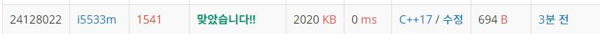

# 괄호 추가하기  

문제
길이가 N인 수식이 있다. 수식은 0보다 크거나 같고, 9보다 작거나 같은 정수와 연산자(+, -, ×)로 이루어져 있다. 연산자 우선순위는 모두 동일하기 때문에, 수식을 계산할 때는 왼쪽에서부터 순서대로 계산해야 한다. 예를 들어, 3+8×7-9×2의 결과는 136이다.

수식에 괄호를 추가하면, 괄호 안에 들어있는 식은 먼저 계산해야 한다. 단, 괄호 안에는 연산자가 하나만 들어 있어야 한다. 예를 들어, 3+8×7-9×2에 괄호를 3+(8×7)-(9×2)와 같이 추가했으면, 식의 결과는 41이 된다. 하지만, 중첩된 괄호는 사용할 수 없다. 즉, 3+((8×7)-9)×2, 3+((8×7)-(9×2))은 모두 괄호 안에 괄호가 있기 때문에, 올바른 식이 아니다.

수식이 주어졌을 때, 괄호를 적절히 추가해 만들 수 있는 식의 결과의 최댓값을 구하는 프로그램을 작성하시오. 추가하는 괄호 개수의 제한은 없으며, 추가하지 않아도 된다.

입력
첫째 줄에 수식의 길이 N(1 ≤ N ≤ 19)가 주어진다. 둘째 줄에는 수식이 주어진다. 수식에 포함된 정수는 모두 0보다 크거나 같고, 9보다 작거나 같다. 문자열은 정수로 시작하고, 연산자와 정수가 번갈아가면서 나온다. 연산자는 +, -, * 중 하나이다. 여기서 ```*```는 곱하기 연산을 나타내는 × 연산이다. 항상 올바른 수식만 주어지기 때문에, N은 홀수이다.

출력
첫째 줄에 괄호를 적절히 추가해서 얻을 수 있는 결과의 최댓값을 출력한다. 정답은 231보다 작고, -231보다 크다.

## Example1

```
Input: 
9
3+8*7-9*2

Output: 
136
```

## Example2

```
Input: 
5
8*3+5

Output: 
64
```


## trial1
### Intuition
```
dfs로 문제를 해결할 수 있고 현재 숫자와 바로 다음 숫자와의 연산을 할때 만약에 다음 숫자와 다음다음 숫자에 대해
괄호가 있다고 생각하고 계산하는 경우와 괄호 없이 순서대로 계산한다고 생각하는 경우로 나누어서
연산을 진행하는 방식이다.
```
### Codes  
```cpp
long cal(long a, long b, char op) {
    int res = 0;
    switch (op) {
    case '*':
        res = a * b;
        break;
    case '+':
        res = a + b;
        break;
    case '-':
        res = a - b;
        break;
    }
    return res;
}
void dfs(long cur,int idx) {
    if (idx == ov.size()) {//모든 operation을 완료한경우
        ans = max(cur, ans);
    }
    else {
        //다음 연산을 괄호로 먼저 계산하는 경우
        if (idx < ov.size() - 1) {
            long nxt = cal(nv[idx + 1], nv[idx + 2], ov[idx + 1]);
            dfs(cal(cur, nxt,ov[idx]), idx + 2);
        }
        //현재 연산을 괄호를 하지 않고 계산하는 경우
        dfs(cal(cur, nv[idx + 1], ov[idx]), idx + 1);
    }
}
int main() {
    freopen("괄호추가하기2.txt", "r", stdin);
    cin >> n;
    string s;
    cin >> s;
    for (int i = 0; i < s.size(); i++) {
        if (s[i] >= '0' && s[i] <= '9') {
            nv.push_back(atoi(&s[i]));
        }
        else {
            visit.push_back(false);
            ov.push_back(s[i]);
        }
    }
    dfs(nv[0],0);
    cout << ans;
    return 0;
}
```

### Results (Performance)  
**Runtime:** 0 ms   
**Memory Usage:**   2020 kb    

<p align="center"> 

</p>


### 문제 URL (백준)  
https://www.acmicpc.net/problem/1541