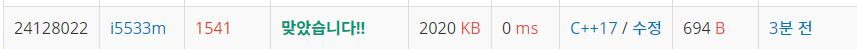

# 잃어버린괄호  

문제
세준이는 양수와 +, -, 그리고 괄호를 가지고 길이가 최대 50인 식을 만들었다. 그리고 나서 세준이는 괄호를 모두 지웠다.

그리고 나서 세준이는 괄호를 적절히 쳐서 이 식의 값을 최소로 만들려고 한다.

괄호를 적절히 쳐서 이 식의 값을 최소로 만드는 프로그램을 작성하시오.

입력
첫째 줄에 식이 주어진다. 식은 ‘0’-‘9’, ‘+’, 그리고 ‘-’만으로 이루어져 있고, 가장 처음과 마지막 문자는 숫자이다. 그리고 연속해서 두 개 이상의 연산자가 나타나지 않고, 5자리보다 많이 연속되는 숫자는 없다. 수는 0으로 시작할 수 있다.

출력
첫째 줄에 정답을 출력한다.

## Example1

```
Input: 
55-50+40

Output: 
-35
```


## trial1
### Intuition
```
앞의 연산부터 하나씩 반복해주면서 -연산이 나올때까지 모든 값을 더해주고 
-가 하나라도 나온다면 그때부터는 모두 -연산을 해주면 된다.
```
### Codes  
```cpp
int main() {
    //freopen("잃어버린괄호.txt", "r", stdin);
    string s;
    cin >> s;
    int ans = 0;
    vector<int> nv;
    vector<char> ov;
    for (int i = 0; i < s.size(); i++) {
        //숫자가 이어질때까지
        string num;
        while (i<s.size() && s[i] >= '0' && s[i] <= '9') {
            num.push_back(s[i]);
            i++;
        }
        nv.push_back(stoi(num));//숫자 넣기
        if (i >= s.size()) break;
        ov.push_back(s[i]);
    }
    int i = 0;
    ans = nv[0];
    while (i<ov.size() && ov[i] == '+') {
        ans += nv[i + 1];
        i++;
    }
    for (; i < ov.size(); i++) {
        ans -= nv[i + 1];
    }
    cout << ans;
}
```

### Results (Performance)  
**Runtime:** 0 ms   
**Memory Usage:**   2020 kb    

<p align="center"> 

</p>


### 문제 URL (백준)  
https://www.acmicpc.net/problem/1541