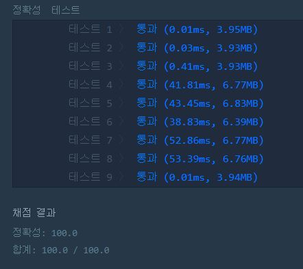

# 입국심사 

문제 설명
n명이 입국심사를 위해 줄을 서서 기다리고 있습니다. 각 입국심사대에 있는 심사관마다 심사하는데 걸리는 시간은 다릅니다.

처음에 모든 심사대는 비어있습니다. 한 심사대에서는 동시에 한 명만 심사를 할 수 있습니다. 가장 앞에 서 있는 사람은 비어 있는 심사대로 가서 심사를 받을 수 있습니다. 하지만 더 빨리 끝나는 심사대가 있으면 기다렸다가 그곳으로 가서 심사를 받을 수도 있습니다.

모든 사람이 심사를 받는데 걸리는 시간을 최소로 하고 싶습니다.

입국심사를 기다리는 사람 수 n, 각 심사관이 한 명을 심사하는데 걸리는 시간이 담긴 배열 times가 매개변수로 주어질 때, 모든 사람이 심사를 받는데 걸리는 시간의 최솟값을 return 하도록 solution 함수를 작성해주세요.

제한사항
입국심사를 기다리는 사람은 1명 이상 1,000,000,000명 이하입니다.
각 심사관이 한 명을 심사하는데 걸리는 시간은 1분 이상 1,000,000,000분 이하입니다.
심사관은 1명 이상 100,000명 이하입니다.

입출력 예 설명
가장 첫 두 사람은 바로 심사를 받으러 갑니다.

7분이 되었을 때, 첫 번째 심사대가 비고 3번째 사람이 심사를 받습니다.

10분이 되었을 때, 두 번째 심사대가 비고 4번째 사람이 심사를 받습니다.

14분이 되었을 때, 첫 번째 심사대가 비고 5번째 사람이 심사를 받습니다.

20분이 되었을 때, 두 번째 심사대가 비지만 6번째 사람이 그곳에서 심사를 받지 않고 1분을 더 기다린 후에 첫 번째 심사대에서 심사를 받으면 28분에 모든 사람의 심사가 끝납니다.

출처

※ 공지 - 2019년 9월 4일 문제에 새로운 테스트 케이스를 추가하였습니다. 도움을 주신 weaver9651 님께 감사드립니다.

**Example1:**   
```
n	times	return
6	[7, 10]	28
```

**Example2:**   
```
7 8 5
0 0 0 0 0 0 0 9
0 0 0 0 3 0 0 8
-1 0 5 0 0 0 22 0
-1 8 0 0 0 0 0 0
0 0 0 0 0 10 43 0
0 0 5 0 15 0 0 0
0 0 40 0 0 0 20 0

172
```


## trial1
### Intuition
```
이 문제는 이분탐색을 활용한 문제이다. 쿠팡 코테에서 이런 비슷한 문제가 나왔던것같은데 비효율적으로 풀었던 기억이 있다.
중요한 식은 걸리는 시간/심사관이 걸리는시간= 그 심사관이 맡을 수 있는 손님수 라는 것이었다.

이렇게 하면 가장 많이 걸리는 시간인 mx는 가장 오래걸리는 심사관의 시간 * 손님수 일 것이고
가장 적게 걸리는 시간 nn은 1일 것이다.
이상태로 이제 mid를 계속 구하면서 최적의 시간을 구해나가면 된다.
```
### Codes  
```cpp
#include <string>
#include <vector>
#include <algorithm>

using namespace std;

long long solution(int n, vector<int> times) {
    long long answer = 0;
    sort(times.begin(),times.end());
    long long mx=(long long)times[times.size()-1]*n;//최대 걸리는 시간
    long long mn=1;
    long long mid=0;
    while(mn<mx){
        mid=(mx+mn)/2;
        long long sum=0;
        for(int i=0;i<times.size();i++){
            sum+=mid/times[i];//현재 times에 대한 명수
        }
        if(sum<n) mn=mid+1;//시간을 너무 적게 잡았다.
        else{
            if(sum>=n){
                answer=mid;
            }
            mx=mid-1;
        }
    }
    return answer;
}
```
### Results (Performance)  
**Runtime:**  60 ms O(trc) (t=초수, r=row, c=column)  
**Memory Usage:** 	1996 MB  


<p align="center"> 

</p>


### 문제 URL (프로그래머스)  
https://programmers.co.kr/learn/courses/30/lessons/43238