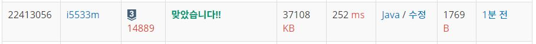

# 스타트와링크

문제  
오늘은 스타트링크에 다니는 사람들이 모여서 축구를 해보려고 한다. 축구는 평일 오후에 하고 의무 참석도 아니다. 축구를 하기 위해 모인 사람은 총 N명이고 신기하게도 N은 짝수이다. 이제 N/2명으로 이루어진 스타트 팀과 링크 팀으로 사람들을 나눠야 한다.  

BOJ를 운영하는 회사 답게 사람에게 번호를 1부터 N까지로 배정했고, 아래와 같은 능력치를 조사했다. 능력치 Sij는 i번 사람과 j번 사람이 같은 팀에 속했을 때, 팀에 더해지는 능력치이다. 팀의 능력치는 팀에 속한 모든 쌍의 능력치 Sij의 합이다. Sij는 Sji와 다를 수도 있으며, i번 사람과 j번 사람이 같은 팀에 속했을 때, 팀에 더해지는 능력치는 Sij와 Sji이다.  

N=4이고, S가 아래와 같은 경우를 살펴보자.  

i\j 1   2   3   4
1       1   2   3
2   4       5   6
3   7   1       2
4   3   4   5    
예를 들어, 1, 2번이 스타트 팀, 3, 4번이 링크 팀에 속한 경우에 두 팀의 능력치는 아래와 같다.  

스타트 팀: S12 + S21 = 1 + 4 = 5  
링크 팀: S34 + S43 = 2 + 5 = 7  
1, 3번이 스타트 팀, 2, 4번이 링크 팀에 속하면, 두 팀의 능력치는 아래와 같다.  

스타트 팀: S13 + S31 = 2 + 7 = 9  
링크 팀: S24 + S42 = 6 + 4 = 10  
축구를 재미있게 하기 위해서 스타트 팀의 능력치와 링크 팀의 능력치의 차이를 최소로 하려고 한다. 위의 예제와 같은 경우에는 1, 4번이 스타트 팀, 2, 3번 팀이 링크 팀에 속하면 스타트 팀의 능력치는 6, 링크 팀의 능력치는 6이 되어서 차이가 0이 되고 이 값이 최소이다.  

입력  
첫째 줄에 N(4 ≤ N ≤ 20, N은 짝수)이 주어진다. 둘째 줄부터 N개의 줄에 S가 주어진다. 각 줄은 N개의 수로 이루어져 있고, i번 줄의 j번째 수는 Sij 이다. Sii는 항상 0이고, 나머지 Sij는 1보다 크거나 같고, 100보다 작거나 같은 정수이다.  

출력  
첫째 줄에 스타트 팀과 링크 팀의 능력치의 차이의 최솟값을 출력한다.  

## Example1

```
Input: 
4
0 1 2 3
4 0 5 6
7 1 0 2
3 4 5 0

Output: 
0
```

## trial1
### Intuition
```
dfs방법으로 문제를 해결하였고 먼저 team을 스타트와 링크로 나누어야하는데 나누는 경우의 수에 대해서 조합을
구해준다.
그리고 만약에 스타트와 링크로 팀이 이루어진 경우에는 cal()이라는 함수를 실행시켜주어 경우의수를 구한것에 대해서 각 팀의 능력치의 합을 구하고 더 작은 값으로 계속 업데이트 해준다.
```
### Codes  
```cpp
public class Main {
    static int n;
    static int[][] arr;
    static boolean[] team;
    static int mini=Integer.MAX_VALUE;
    public static void dfs(int cur,int count) {
        if(count==n/2) {
            cal();
        }else {
            for(int i=cur;i<=n;i++) {
                team[i]=true;
                dfs(i+1,count+1);
                team[i]=false;
            }
        }
        
    }
    public static void cal() {
        int st[]=new int[n/2];
        int lk[]=new int[n/2];
        int sidx=0;
        int lidx=0;
        for(int i=1;i<=n;i++) {
            if(team[i]) {
                lk[lidx++]=i;
            }else {
                st[sidx++]=i;
            }
        }
        int stsum=0;
        int lksum=0;
        for(int i=0;i<n/2;i++) {
            for(int j=i+1;j<n/2;j++) {
                stsum+=arr[st[i]][st[j]]+arr[st[j]][st[i]];
                lksum+=arr[lk[i]][lk[j]]+arr[lk[j]][lk[i]];
            }
        }
        mini=Math.min(mini,Math.abs(stsum-lksum));
    }
    public static void main(String[] args) throws IOException {
        BufferedReader br=new BufferedReader(new InputStreamReader(System.in));
        StringTokenizer st=new StringTokenizer(br.readLine());
        
        n=Integer.parseInt(st.nextToken());
        arr=new int[n+1][n+1];
        team=new boolean[n+1];
        for(int i=1;i<=n;i++) {
            st=new StringTokenizer(br.readLine());
            for(int j=1;j<=n;j++) {
                 arr[i][j]=Integer.parseInt(st.nextToken());
            }
        }
        dfs(1,0);
        
        StringBuilder sb=new StringBuilder();
        sb.append(mini).append("\n");
        System.out.println(sb);
    }

}

```

### Results (Performance)  
**Runtime:** 252 ms   
**Memory Usage:**   37108 kb    

<p align="center"> 

</p>


### 문제 URL (백준)  
https://www.acmicpc.net/problem/14889