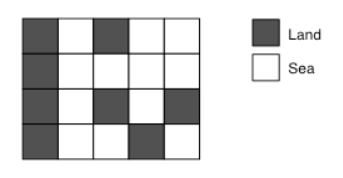

# 섬의 개수

문제
정사각형으로 이루어져 있는 섬과 바다 지도가 주어진다. 섬의 개수를 세는 프로그램을 작성하시오.

<p align="center"> 

</p>

한 정사각형과 가로, 세로 또는 대각선으로 연결되어 있는 사각형은 걸어갈 수 있는 사각형이다. 

두 정사각형이 같은 섬에 있으려면, 한 정사각형에서 다른 정사각형으로 걸어서 갈 수 있는 경로가 있어야 한다. 지도는 바다로 둘러싸여 있으며, 지도 밖으로 나갈 수 없다.

입력
입력은 여러 개의 테스트 케이스로 이루어져 있다. 각 테스트 케이스의 첫째 줄에는 지도의 너비 w와 높이 h가 주어진다. w와 h는 50보다 작거나 같은 양의 정수이다.

둘째 줄부터 h개 줄에는 지도가 주어진다. 1은 땅, 0은 바다이다.

입력의 마지막 줄에는 0이 두 개 주어진다.

출력
각 테스트 케이스에 대해서, 섬의 개수를 출력한다.


## Example1

```
Input: 
1 1
0
2 2
0 1
1 0
3 2
1 1 1
1 1 1
5 4
1 0 1 0 0
1 0 0 0 0
1 0 1 0 1
1 0 0 1 0
5 4
1 1 1 0 1
1 0 1 0 1
1 0 1 0 1
1 0 1 1 1
5 5
1 0 1 0 1
0 0 0 0 0
1 0 1 0 1
0 0 0 0 0
1 0 1 0 1
0 0

Output: 
0
1
1
3
1
9
```

## trial1
### Intuition
```
BFS를 활용한 문제로 이중 for문을 돌려 땅을 발견할때마다 발견한 땅에 대해 
연결된 모든 땅들을 확인해주는 방식으로 진행하면된다.
연결된 땅은 1에서 0으로 값을 바꿔주면 visit를 사용할 필요 없이 구현이 가능하다.
```
### Codes  
```cpp
public class Main{    
    static class b{
        int x;
        int y;
    }
    
    static int arr[][];
    //xx와 yy는 다음 경로로 가기 위한 좌표 현재 00 기준으로 12시부터 시계방향
    static int xx[]= {0,1,1,1,0,-1,-1,-1};
    static int yy[]= {-1,-1,0,1,1,1,0,-1};
    public static void main(String[] args) throws Exception{
        // TODO Auto-generated method stub
        BufferedReader br=new BufferedReader(new InputStreamReader(System.in));
        //StringTokenizer st=new StringTokenizer(br.readLine());
        StringTokenizer st;
        StringBuilder sb=new StringBuilder();
        while(true) {//모든지도를 읽어올때까지
            st=new StringTokenizer(br.readLine());
            int m=Integer.parseInt(st.nextToken());
            int n=Integer.parseInt(st.nextToken());
            if(n==0 || m==0) break;
            arr=new int[n][m];
            for(int i=0;i<n;i++) {//입력받기
                st=new StringTokenizer(br.readLine());
                for(int j=0;j<m;j++) {
                    arr[i][j]=Integer.parseInt(st.nextToken());
                }
            }
            
            Queue<b> q=new LinkedList<b>();
            int cnt=0;
            for(int i=0;i<n;i++) {//돌면서 땅찾기
                for(int j=0;j<m;j++) {
                    if(arr[i][j]==1) {
                        cnt++;
                        b cur=new b();//발견한땅 큐에 넣기
                        cur.x=j;
                        cur.y=i;
                        arr[i][j]=0;
                        q.offer(cur);
                        while(!q.isEmpty()) {//BFS 시작
                            cur=q.poll();
                            for(int z=0;z<8;z++) {
                                int nx=cur.x+xx[z];//다음 좌표 값
                                int ny=cur.y+yy[z];
                                if(nx>=0 && ny>=0 && nx<m && ny<n && arr[ny][nx]==1) {//범위 안에 들었는지 확인, 그리고 현재 위치가 땅일 경우에만 큐에 넣기
                                    b nw=new b();
                                    nw.x=nx;
                                    nw.y=ny;
                                    arr[ny][nx]=0;
                                    q.offer(nw);
                                }
                            }
                        }
                    }
                }
            }
            sb.append(cnt).append("\n");
        }
        System.out.println(sb);
    }

}

```

### Results (Performance)  
**Runtime:** 132 ms   
**Memory Usage:**   15764 kb    

<p align="center"> 

</p>


### 문제 URL (백준)  
https://www.acmicpc.net/problem/4963