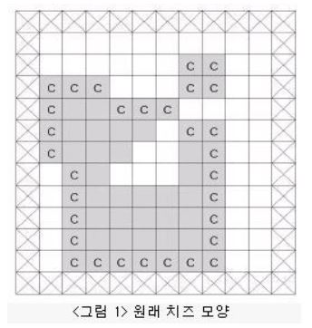
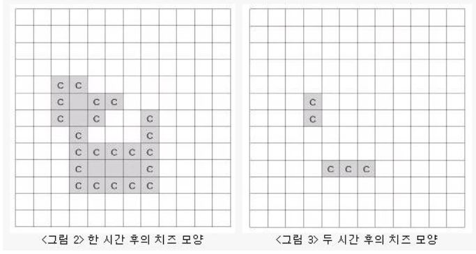
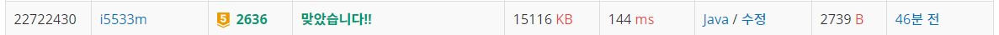

# 치즈

문제
아래 <그림 1>과 같이 정사각형 칸들로 이루어진 사각형 모양의 판이 있고, 그 위에 얇은 치즈(회색으로 표시된 부분)가 놓여 있다. 판의 가장자리(<그림 1>에서 네모 칸에 X친 부분)에는 치즈가 놓여 있지 않으며 치즈에는 하나 이상의 구멍이 있을 수 있다.

이 치즈를 공기 중에 놓으면 녹게 되는데 공기와 접촉된 칸은 한 시간이 지나면 녹아 없어진다. 치즈의 구멍 속에는 공기가 없지만 구멍을 둘러싼 치즈가 녹아서 구멍이 열리면 구멍 속으로 공기가 들어가게 된다. <그림 1>의 경우, 치즈의 구멍을 둘러싼 치즈는 녹지 않고 ‘c’로 표시된 부분만 한 시간 후에 녹아 없어져서 <그림 2>와 같이 된다.  

<p align="center"> 

</p>

다시 한 시간 후에는 <그림 2>에서 ‘c’로 표시된 부분이 녹아 없어져서 <그림 3>과 같이 된다.

<p align="center"> 

</p>

<그림 3>은 원래 치즈의 두 시간 후 모양을 나타내고 있으며, 남은 조각들은 한 시간이 더 지나면 모두 녹아 없어진다. 그러므로 처음 치즈가 모두 녹아 없어지는 데는 세 시간이 걸린다. <그림 3>과 같이 치즈가 녹는 과정에서 여러 조각으로 나누어 질 수도 있다.

입력으로 사각형 모양의 판의 크기와 한 조각의 치즈가 판 위에 주어졌을 때, 공기 중에서 치즈가 모두 녹아 없어지는 데 걸리는 시간과 모두 녹기 한 시간 전에 남아있는 치즈조각이 놓여 있는 칸의 개수를 구하는 프로그램을 작성하시오.

입력
첫째 줄에는 사각형 모양 판의 세로와 가로의 길이가 양의 정수로 주어진다. 세로와 가로의 길이는 최대 100이다. 판의 각 가로줄의 모양이 윗 줄부터 차례로 둘째 줄부터 마지막 줄까지 주어진다. 치즈가 없는 칸은 0, 치즈가 있는 칸은 1로 주어지며 각 숫자 사이에는 빈칸이 하나씩 있다.

출력
첫째 줄에는 치즈가 모두 녹아서 없어지는 데 걸리는 시간을 출력하고, 둘째 줄에는 모두 녹기 한 시간 전에 남아있는 치즈조각이 놓여 있는 칸의 개수를 출력한다.


## Example1

```
Input: 
13 12
0 0 0 0 0 0 0 0 0 0 0 0
0 0 0 0 0 0 0 0 0 0 0 0
0 0 0 0 0 0 0 1 1 0 0 0
0 1 1 1 0 0 0 1 1 0 0 0
0 1 1 1 1 1 1 0 0 0 0 0
0 1 1 1 1 1 0 1 1 0 0 0
0 1 1 1 1 0 0 1 1 0 0 0
0 0 1 1 0 0 0 1 1 0 0 0
0 0 1 1 1 1 1 1 1 0 0 0
0 0 1 1 1 1 1 1 1 0 0 0
0 0 1 1 1 1 1 1 1 0 0 0
0 0 1 1 1 1 1 1 1 0 0 0
0 0 0 0 0 0 0 0 0 0 0 0

Output: 
3
5
```

## trial1
### Intuition
```
공기에 대한 bfs를 돌려 모두 3으로 치환해주고 치즈에 대해 bfs를 돌려 바깥공기와
마주하고 있는 치즈들을 모두 공기로 바꿔준다. 공기로 바뀐 치즈도 air라는 큐에 넣는다.
치즈에 대한 클래스의 cnt는 시간을 나타내는 것으로 이 시간이 바뀌는 경우마다 공기의 움직임이 변화하고
최대 걸린 시간으로 갱신해준다. 
이때 오리지날 arr를 tmp로 만들어주는데 이 작업은 치즈가 공기로 바뀌더라도 다른 치즈로부터 영향을 받지 않도록 하기 위함이다.
모든 작업이 끝나고 q가 비어있기 되면 치즈는 모두 사라진것으로 간주된다.
```
### Codes  
```cpp
public class Main{
    static class ch implements Comparable<ch>{
        int x;
        int y;
        int cnt=1;
        @Override
        public int compareTo(ch b) {
            return this.cnt-b.cnt;//cnt가 작은게 앞으로가기
        }
    }
    static int xx[]= {0,1,0,-1};
    static int yy[]= {-1,0,1,0};
    static int n=0,m=0;
    static int arr[][];
    public static void main(String[] args) throws Exception {
        // TODO Auto-generated method stub

        BufferedReader br=new BufferedReader(new InputStreamReader(System.in));
        StringTokenizer st=new StringTokenizer(br.readLine());
        n=Integer.parseInt(st.nextToken());
        m=Integer.parseInt(st.nextToken());
        
        PriorityQueue<ch> q=new PriorityQueue<ch>();
        Queue<ch> air=new LinkedList<ch>();
        
        arr=new int[n][m];
        for(int i=0;i<n;i++) {
            st=new StringTokenizer(br.readLine());
            for(int j=0;j<m;j++) {
                arr[i][j]=Integer.parseInt(st.nextToken());
                if(arr[i][j]==1) {//모두 넣기
                    ch nw=new ch();
                    nw.x=j;
                    nw.y=i;
                    q.offer(nw);
                }else {
                    if(i==0 || i==n-1 || j==0 || j==m-1) {
                        arr[i][j]=3;
                        ch a=new ch();
                        a.x=j;
                        a.y=i;
                        air.offer(a);
                    }
                }
            }
        }
        ch cur=null;
        int mx=0;
        int allcnt=0;
        int tmp[][]=new int[n][m];
        while(!q.isEmpty()) {//치즈에 대해서
            cur=q.poll();
            if(cur.cnt>mx) {//다음 카운트가 존재하는경우
                mx=cur.cnt;
                outside(air);//공기에 대해서
                copy(arr,tmp);//이전 tmp
                allcnt=q.size()+1;
            }
            boolean cnt=false;
            for(int i=0;i<4;i++) {
                int nx=cur.x+xx[i];
                int ny=cur.y+yy[i];
                if(nx>=0 &&ny>=0 && nx<m && ny<n) {
                    if(tmp[ny][nx]==3) {//한면이라도 바깥공기라면
                    cnt=true;
                    break;
                    }
                }
            }
            if(!cnt) {
                cur.cnt=cur.cnt+1;
                q.offer(cur);
            }else {
                arr[cur.y][cur.x]=3;
                air.offer(cur);//현재 치즈였던거는 공기가 됨
            }
        }
        StringBuilder sb=new StringBuilder();
        sb.append(mx).append("\n").append(allcnt).append("\n");
        System.out.println(sb);
    }
    public static void copy(int arr[][],int tmp[][]) {
        for(int i=0;i<arr.length;i++) {
            for(int j=0;j<arr[i].length;j++) {
                tmp[i][j]=arr[i][j];
            }
        }
    }
    public static void outside(Queue<ch> air) {
        ch cur;
        while(!air.isEmpty()) {
            cur=air.poll();
            arr[cur.y][cur.x]=3;
            for(int i=0;i<4;i++) {
                int nx=cur.x+xx[i];
                int ny=cur.y+yy[i];
                if(nx>=0 &&ny>=0 && nx<m && ny<n && arr[ny][nx]==0) {
                    arr[ny][nx]=3;
                    ch nw=new ch();
                    nw.x=nx;
                    nw.y=ny;
                    air.offer(nw);
                }
            }
        }
    }


}

```

### Results (Performance)  
**Runtime:** 132 ms   
**Memory Usage:**   15764 kb    

<p align="center"> 

</p>


### 문제 URL (백준)  
https://www.acmicpc.net/problem/4963