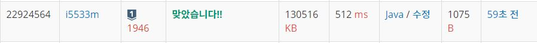

# 신입사원

문제
언제나 최고만을 지향하는 굴지의 대기업 진영 주식회사가 신규 사원 채용을 실시한다. 인재 선발 시험은 1차 서류심사와 2차 면접시험으로 이루어진다. 최고만을 지향한다는 기업의 이념에 따라 그들은 최고의 인재들만을 사원으로 선발하고 싶어 한다.

그래서 진영 주식회사는, 다른 모든 지원자와 비교했을 때 서류심사 성적과 면접시험 성적 중 적어도 하나가 다른 지원자보다 떨어지지 않는 자만 선발한다는 원칙을 세웠다. 즉, 어떤 지원자 A의 성적이 다른 어떤 지원자 B의 성적에 비해 서류 심사 결과와 면접 성적이 모두 떨어진다면 A는 결코 선발되지 않는다.

이러한 조건을 만족시키면서, 진영 주식회사가 이번 신규 사원 채용에서 선발할 수 있는 신입사원의 최대 인원수를 구하는 프로그램을 작성하시오.

입력
첫째 줄에는 테스트 케이스의 개수 T(1 ≤ T ≤ 20)가 주어진다. 각 테스트 케이스의 첫째 줄에 지원자의 숫자 N(1 ≤ N ≤ 100,000)이 주어진다. 둘째 줄부터 N개 줄에는 각각의 지원자의 서류심사 성적, 면접 성적의 순위가 공백을 사이에 두고 한 줄에 주어진다. 두 성적 순위는 모두 1위부터 N위까지 동석차 없이 결정된다고 가정한다.

출력
각 테스트 케이스에 대해서 진영 주식회사가 선발할 수 있는 신입사원의 최대 인원수를 한 줄에 하나씩 출력한다.


## Example1

```
Input: 
2
5
3 2
1 4
4 1
2 3
5 5
7
3 6
7 3
4 2
1 4
5 7
2 5
6 1

Output: 
4
3
```

## trial1
### Intuition
```
Greedy 알고리즘을 사용해서 문제를 해결했다. 어차피 등수는 하나이기 때문에 
서류점수를 인덱스로 사용하고 면접 점수를 배열에 넣도록 햇다. 
그리고 서류점수가 1등인 사람의 면접등수를 기준으로 서류등수를 오름차순(등수는 숫자가 높을수록 낮은등수)으로 
차례대로 방문하면서 현재 기준인 면접등수보다 낮으면 탈락이고 높으면 그 사람의 면접등수가 기준이 되어 그 뒤를 체크한다.
```
### Codes  
```java
public class Main {
   public static void main(String[] args) throws Exception{
 
        BufferedReader br=new BufferedReader(new InputStreamReader(System.in));
        StringTokenizer st=new StringTokenizer(br.readLine());
        StringBuilder sb=new StringBuilder();
        int TC=Integer.parseInt(st.nextToken());
        
        for(int t=0;t<TC;t++) {
            int n;
            st=new StringTokenizer(br.readLine());
            n=Integer.parseInt(st.nextToken());
            //Queue<per> q=new LinkedList<per>();
            int arr[]=new int[n+1];
            for(int i=0;i<n;i++) {
                st=new StringTokenizer(br.readLine());
                arr[Integer.parseInt(st.nextToken())]=Integer.parseInt(st.nextToken());
            }
            int mx=arr[1];
            for(int i=2;i<arr.length;i++) {
                if(mx<arr[i]) n--;
                else mx=arr[i];
            }
            sb.append(n).append("\n");
        }
        System.out.println(sb);
        
    }

}

```

### Results (Performance)  
**Runtime:** 512 ms   
**Memory Usage:**   130516 kb    

<p align="center"> 

</p>


### 문제 URL (백준)  
https://www.acmicpc.net/problem/1946