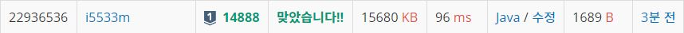

# 연산자 끼워넣기

문제  
N개의 수로 이루어진 수열 A1, A2, ..., AN이 주어진다. 또, 수와 수 사이에 끼워넣을 수 있는 N-1개의 연산자가 주어진다. 연산자는 덧셈(+), 뺄셈(-), 곱셈(×), 나눗셈(÷)으로만 이루어져 있다.  

우리는 수와 수 사이에 연산자를 하나씩 넣어서, 수식을 하나 만들 수 있다. 이때, 주어진 수의 순서를 바꾸면 안 된다.  

예를 들어, 6개의 수로 이루어진 수열이 1, 2, 3, 4, 5, 6이고, 주어진 연산자가 덧셈(+) 2개, 뺄셈(-) 1개, 곱셈(×) 1개, 나눗셈(÷) 1개인 경우에는 총 60가지의 식을 만들 수 있다. 예를 들어, 아래와 같은 식을 만들 수 있다.  

1+2+3-4×5÷6  
1÷2+3+4-5×6  
1+2÷3×4-5+6  
1÷2×3-4+5+6  
식의 계산은 연산자 우선 순위를 무시하고 앞에서부터 진행해야 한다. 또, 나눗셈은 정수 나눗셈으로 몫만 취한다. 음수를 양수로 나눌 때는 C++14의 기준을 따른다. 즉, 양수로 바꾼 뒤 몫을 취하고, 그 몫을 음수로 바꾼 것과 같다. 이에 따라서, 위의 식 4개의 결과를 계산해보면 아래와 같다.  

1+2+3-4×5÷6 = 1  
1÷2+3+4-5×6 = 12  
1+2÷3×4-5+6 = 5  
1÷2×3-4+5+6 = 7  
N개의 수와 N-1개의 연산자가 주어졌을 때, 만들 수 있는 식의 결과가 최대인 것과 최소인 것을 구하는 프로그램을 작성하시오.  

입력  
첫째 줄에 수의 개수 N(2 ≤ N ≤ 11)가 주어진다. 둘째 줄에는 A1, A2, ..., AN이 주어진다. (1 ≤ Ai ≤ 100) 셋째 줄에는 합이 N-1인 4개의 정수가 주어지는데, 차례대로 덧셈(+)의 개수, 뺄셈(-)의 개수, 곱셈(×)의 개수, 나눗셈(÷)의 개수이다.   

출력  
첫째 줄에 만들 수 있는 식의 결과의 최댓값을, 둘째 줄에는 최솟값을 출력한다. 연산자를 어떻게 끼워넣어도 항상 -10억보다 크거나 같고, 10억보다 작거나 같은 결과가 나오는 입력만 주어진다. 또한, 앞에서부터 계산했을 때, 중간에 계산되는 식의 결과도 항상 -10억보다 크거나 같고, 10억보다 작거나 같다.  

## Example1

```
Input: 
2
5 6
0 0 1 0

Output: 
30
30
```

## Example2

```
Input: 
3
3 4 5
1 0 1 0

Output: 
35
17
```

## Example3

```
Input: 
6
1 2 3 4 5 6
2 1 1 1

Output: 
54
-24
```

## trial1
### Intuition
```
dfs와 백트래킹으로 순열을 구했다. dfs의 if문에서는 모든 주어진 숫자를 끝까지 방문한 경우에 max값인지 min값인지 구하고
아직 주어진 숫자를 모두 방문하지 않은 상태에서 4가지의 operation에 대해 만약에 남은 operation개수가 1이상인경우에 
계산해서 다음 dfs 매개변수로 넘겨준다.
```
### Codes  
```java
public class Main {
    //static private final String INPUT="C:/spring_workspace/DailyCodingJAVA/input/Main_14888.txt";
    static int comp[]=new int[4];//연산자
    static int arr[];
    static long mx=Long.MIN_VALUE;
    static long mn=Long.MAX_VALUE;
    static int n=0;
    public static void dfs(int cur,long res) {
        if(cur==n) {
            mx=(long)Math.max(res, mx);
            mn=(long)Math.min(res, mn);
        }else {
            for(int i=0;i<4;i++) {
                if(comp[i]>0) {
                    comp[i]--;
                    switch(i) {
                    case 0://
                        res+=arr[cur];
                        dfs(cur+1,res);
                        res-=arr[cur];
                        break;
                    case 1:
                        res-=arr[cur];
                        dfs(cur+1,res);
                        res+=arr[cur];
                        break;
                    case 2:
                        res*=arr[cur];
                        dfs(cur+1,res);
                        res/=arr[cur];
                        break;
                    case 3:
                        res/=arr[cur];
                        dfs(cur+1,res);
                        res*=arr[cur];
                        break;
                    }
                    comp[i]++;
                }
            }
        }
    }
    public static void main(String[] args) throws Exception{
        //FileInputStream fs=new FileInputStream(INPUT);
        //System.setIn(fs);
        ///
        //System.out.println(-10/3+"");
        BufferedReader br=new BufferedReader(new InputStreamReader(System.in));
        StringTokenizer st=new StringTokenizer(br.readLine());
        n=Integer.parseInt(st.nextToken());
        st=new StringTokenizer(br.readLine());
        
        arr=new int[n];//숫자
        for(int i=0;i<n;i++) {
            arr[i]=Integer.parseInt(st.nextToken());
        }
        st=new StringTokenizer(br.readLine());
        for(int i=0;i<4;i++) {
            comp[i]=Integer.parseInt(st.nextToken());
        }
        long res=arr[0];
        dfs(1,res);
        StringBuilder sb=new StringBuilder();
        sb.append(mx).append("\n").append(mn).append("\n");
        System.out.println(sb);
    }

}

```

### Results (Performance)  
**Runtime:** 90 ms   
**Memory Usage:**   130516 kb    

<p align="center"> 

</p>


### 문제 URL (백준)  
https://www.acmicpc.net/problem/14888